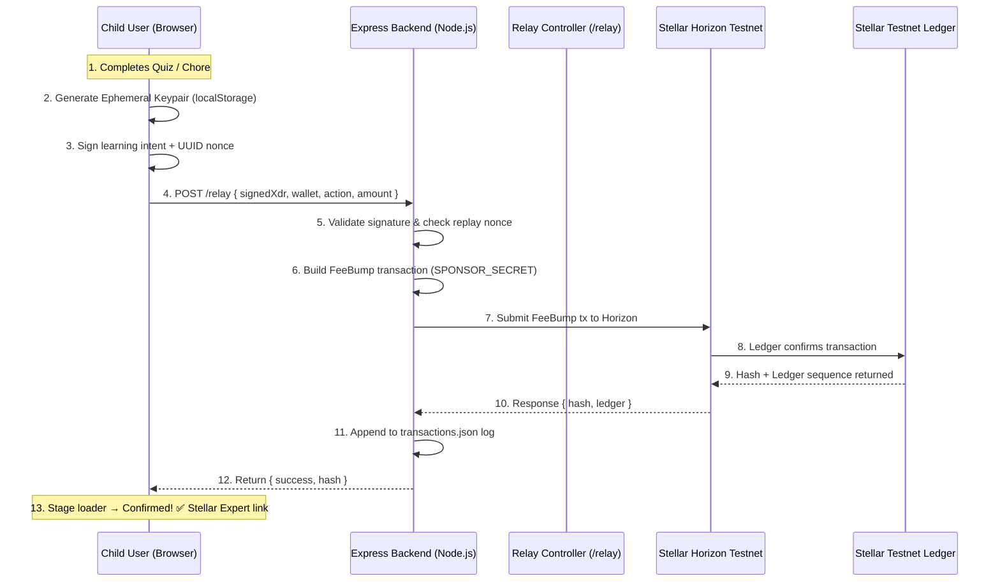

# 🧠 LittleInvestors — Architecture Document

LittleInvestors separates child-friendly learning incentives from blockchain gas execution using a **dual-path Non-Custodial Wallet structure** and an on-chain **FeeBump transaction Relayer**.

---

## System Diagram



---

## Core Components

### 1. Client-Side Learning Agent (`js/stellar-helper.js`)
- Generates a **non-custodial ephemeral keypair** in the browser using the `@stellar/stellar-sdk`.
- Stores the private key in `localStorage` — never sent to the server.
- Signs educational intent requests (e.g. claim quiz reward, vault spend request) using the session private key.
- Attaches a `crypto.randomUUID()` nonce to prevent replay attacks.
- Submits the signed XDR to the backend `/relay` endpoint.

### 2. Soroban Smart Vault Contract (`contracts/vault`)
- Written in **Rust** targeting the Soroban smart contract VM.
- Implements **daily spending limit** enforcement and a **saved pool balance** for savings goals.
- Enforces `parent.require_auth()` for all limit configuration operations.
- Accepts parent-funded deposits and tracks child allowance balances on-chain.
- Deployed to Stellar Testnet via `stellar contract deploy`.

### 3. Integrated Relay Controller (`src/controller/stellarRelayController.js`)
The primary relay path, embedded in the Express app — no separate process required:
- **`/health`** — Returns `{ status, uptime, relayerAddress, totalSponsoredTransactions }`.
- **`/api/metrics`** — Aggregates `transactions.json` into `{ totalTransactions, uniqueWalletsCount, repeatWalletsCount, activeDays, totalCoinsClaimed, sponsorSpendXlm, recentTransactions }`.
- **`/relay`** (POST) — Core FeeBump relay:
  1. Decodes `signedXdr` → `innerTx` using `TransactionBuilder.fromXDR`.
  2. Builds a `FeeBump` wrapping transaction signed with `SPONSOR_SECRET`.
  3. Submits to `https://horizon-testnet.stellar.org`.
  4. Logs `{ id, timestamp, wallet, action, amount, txHash, feeSponsored }` to `relayer/data/transactions.json`.
  5. Falls back to a mock hash in local/offline environments for development.

### 4. Standalone Relayer (`relayer/index.js`)
- Identical relay logic available as an **isolated Node.js process** on port 3001.
- Useful for staging, separate deployment, or running the relayer independently from the main app.

### 5. Web Frontend (Express + EJS)
- **Landing Page** (`/`) — Animated hero with "Start Learning" CTA.
- **Kid Dashboard** (`/home`) — Pocket coin balance, news feed, Yahoo Finance sparklines, stock simulator.
- **Quiz** (`/quiz`) — Multi-step quiz with gasless coin reward on correct answer.
- **Parent Mode** (`/parent`) — PIN-gated glassmorphic overlay; Freighter wallet connect or local key derivation; Smart Vault deployment and daily limit configuration.
- **Gemini AI Chatbot** — Kid-friendly blockchain tutor powered by Google Gemini API.
- **Interactive Onboarding** — 3-step guided tour on first dashboard visit.
- **Pendo Analytics** — Real user behaviour tracking across all EJS views.

---

## Data Flow

```
Quiz/Chore Completion
       │
       ▼
Browser generates ephemeral keypair (localStorage)
       │
       ▼
Signs XDR + UUID nonce
       │
       ▼
POST /relay ──► stellarRelayController.js
                    │
                    ├─ Validate nonce (replay protection)
                    ├─ Build FeeBump tx (SPONSOR_SECRET)
                    ├─ Submit to Horizon Testnet
                    └─ Log to transactions.json
                              │
                              ▼
                    GET /api/metrics ──► Aggregated dashboard
                    GET /health     ──► Uptime monitoring
```

---

## Security Architecture

| Layer | Control |
|---|---|
| Replay Protection | `crypto.randomUUID()` nonce tracked in relayer |
| Non-Custodial | Private key stays in `localStorage`, never transmitted |
| Sponsor Key Isolation | `SPONSOR_SECRET` server-only env variable |
| Rate Limiting | 100 req / 15 min / IP via `express-rate-limit` |
| Parent Authorization | PIN-gated Parent Mode; Soroban `require_auth()` on contract ops |

---

## Technology Stack

| Layer | Technology |
|---|---|
| Backend | Node.js 18 + Express 4 |
| Templating | EJS |
| Blockchain SDK | `@stellar/stellar-sdk` v12 |
| Smart Contracts | Rust + Soroban |
| AI Chatbot | Google Gemini API |
| Analytics | Pendo SDK |
| Deployment | Railway (app) + Vercel (static fallback) |
| Data Store | JSON flat-file log (`relayer/data/transactions.json`) |
