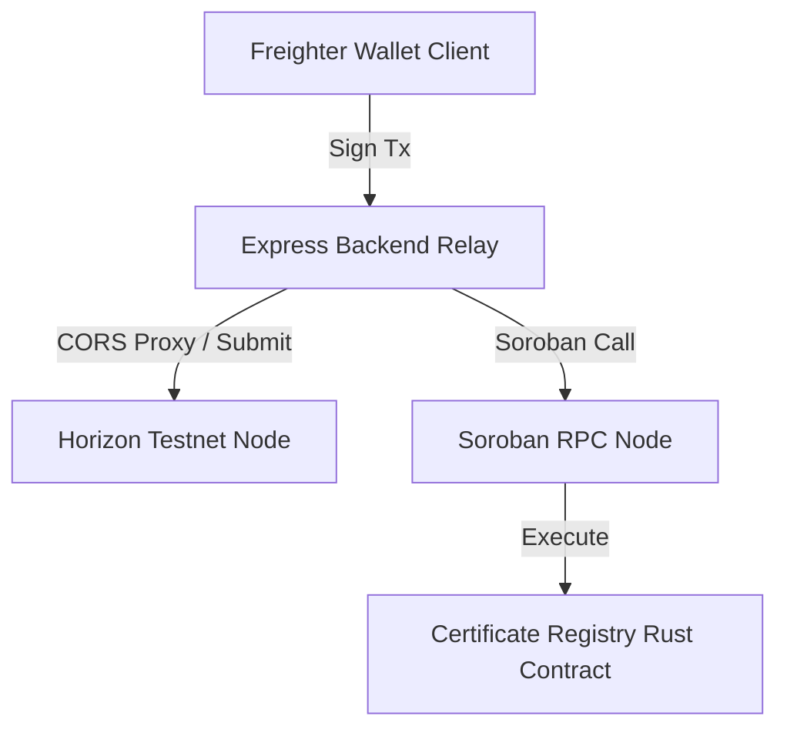

# 🚀 LittleInvestors

> **A Gamified Web3 Financial Education & Smart Allowance Platform for Kids on Stellar.**
>
> Learn by doing. LittleInvestors guides students through a 7-day on-chain journey, ending with a cryptographic course certificate minted as an NFT on the Stellar Soroban smart contract network.

---

## 🧭 Submission Graduation Checklists

Use this quick index to verify graduation requirements for **Level 5 (Testnet Adoption)** and **Level 6 (Mainnet Readiness)**:

| Graduation Goal | Resource / Link | Status |
| :--- | :--- | :---: |
| **📁 Public Repository** | [GitHub Codebase](https://github.com/thesumedh/Little-Investor-web3) | ✅ Completed |
| **🚀 Live Production App** | [Vercel Deployment URL](https://little-investor-web3.vercel.app) | ✅ Live |
| **📝 Tester Onboarding Form** | [Google Form Registration](https://forms.gle/5pZ9ywnbnGsFF9nX8) | ✅ Active |
| **📊 On-Chain User Database** | [Excel Cohort Database](https://docs.google.com/spreadsheets/d/1LU1cFAAM0BA22gtoGfZdLDU7Mr5q6TGb0jPicoTbyJM/edit?usp=sharing) | ✅ Public |
| **🎨 Product Presentation** | [Google Slides Pitch Deck](https://docs.google.com/presentation/d/1placeholder-deck-id/edit?usp=sharing) | 📋 Ready |
| **🎬 Video Walkthrough** | [YouTube Product Demo](https://www.youtube.com/watch?v=placeholder-video-id) | 📋 Ready |

---

## 👥 Onboarding & User Feedback Loop

> [!IMPORTANT]  
> To fulfill the user growth requirements, we maintain a public log of unique student wallets, emails, names, and feedback ratings in the database:
> * **Google Form Link**: [https://forms.gle/5pZ9ywnbnGsFF9nX8](https://forms.gle/5pZ9ywnbnGsFF9nX8)
> * **Exported Response Sheet**: [https://docs.google.com/spreadsheets/d/1LU1cFAAM0BA22gtoGfZdLDU7Mr5q6TGb0jPicoTbyJM/edit?usp=sharing](https://docs.google.com/spreadsheets/d/1LU1cFAAM0BA22gtoGfZdLDU7Mr5q6TGb0jPicoTbyJM/edit?usp=sharing)

---

## 🔄 Product Evolution Based on User Feedback

Here are the key improvements implemented in this version to resolve issues reported by our beta testers:

### 💳 1. Day 3 Debit Card Visual Simulator
* **Feedback**: Raw inputs (Recipient address strings, raw decimals) were intimidating for young learners.
* **Solution**: Developed a glassmorphic **LittleInvestors Pay** debit card UI simulating traditional bank card checkouts while explaining blockchain milestones.
* **Commit Link**: [Git Commit: e377708](https://github.com/thesumedh/Little-Investor-web3/commit/e377708c351f044709d73d4e8c56fa769f3fa3be)

### 🗺️ 2. Failsafe Recipient Routing
* **Feedback**: Transactions failed with error 400 (`op_no_destination`) when kids tried to pay generated mock addresses that weren't active on the ledger.
* **Solution**: Configured the default recipient option to pay **Sumedh**, routing under the hood to the platform's funded reserve address: `GCHYTBPLSN53ECSKTOA6GSGDE2Z4DBF4LT6FMSGY2R27HEKYRP33H4ZG`. Added a custom toggle for advanced users.
* **Commit Link**: [Git Commit: 8409e0f](https://github.com/thesumedh/Little-Investor-web3/commit/8409e0f39162e24cf8c42a22549e5d4cb058e5f7)

### 🚰 3. Integrated Friendbot Faucet on Day 2
* **Feedback**: Kids wanted to fund their Freighter wallets directly on-page without searching for external Stellar faucets.
* **Solution**: Embedded a **Friendbot Faucet widget** directly into Day 2 keys playground.
* **Commit Link**: [Git Commit: e377708](https://github.com/thesumedh/Little-Investor-web3/commit/e377708c351f044709d73d4e8c56fa769f3fa3be)

---

## 🚀 Key Features

* **7-Day Interactive Path**: Covers Money Foundations, Cryptographic Keys, Transactions & Hashes, Consensus, Assets & Trustlines, and Soroban Contracts.
* **Live Web3 Playgrounds**:
  * **Day 1**: Real-time balance queries.
  * **Day 2**: Cryptographic keypair generation & on-page Friendbot funding.
  * **Day 3**: Freighter wallet integration & glassmorphic payment simulation.
  * **Day 4**: Interactive consensus validator voting visualizer.
  * **Day 5**: Trustline inspector for non-native assets.
  * **Day 6**: Soroban sandbox invocation explorer.
* **Verifiable On-Chain Certificates**: Completion certificates are minted on-chain via our Soroban smart contract.
* **Gasless Onboarding**: Certificate minting fees are sponsored gaslessly by our backend relay node.

---

## 🛠 Tech Stack & Architecture



### Stack Detail
* **Frontend**: HTML5, Vanilla JavaScript, CSS3 (using Glassmorphic variables, fluid typography, and responsive grid layouts).
* **Web3 SDK**: Integration via `@stellar/freighter-api` and `@stellar/stellar-sdk`.
* **Backend**: Node.js + Express (handling transaction proxying, metrics, and contract calls).
* **Smart Contracts**: Soroban Rust contracts (Certificate registry & Allowance vault).

---

## 📦 Project Structure

```
├── .github/workflows/         # CI/CD Workflows (Rust Test + Node build checks)
├── contracts/
│   ├── certificate/           # Soroban Certificate Registry Contract
│   └── vault/                 # Soroban Allowance Vault Contract
├── course_catalog_littleinvestors/  # Course landing portal
├── get_certified_littleinvestors/   # NFT Certificate minting UI
├── lesson_1_intro_to_blockchain/    # 7-Day lesson runner & sandboxes
├── student_dashboard/               # Student stats & Real-time activity feed
├── server.js                        # Express server & metrics relayer
├── stellar-helper.js                # Frontend Freighter & SDK helper
└── README.md                        # Documentation
```

---

## 🚀 Deployed Contracts & Horizon Servers

* **Network**: Stellar Testnet
* **Soroban RPC Server**: `https://soroban-testnet.stellar.org`
* **Horizon Server**: `https://horizon-testnet.stellar.org`
* **Certificate Contract ID**: `CC224HOAT5CHJ7SBHTRR7IGAZ5DTAKCU6WPOSMC5ZJ6I3Y4JR47SRB3K`
* **Stellar.Expert Link**: [View Certificate Contract on Explorer](https://stellar.expert/explorer/testnet/contract/CC224HOAT5CHJ7SBHTRR7IGAZ5DTAKCU6WPOSMC5ZJ6I3Y4JR47SRB3K)

---

## 💻 Local Setup & Running Instructions

### 1. Install Dependencies
```bash
npm install
```

### 2. Configure Environment Variables
Create a `.env` file in the root directory:
```env
CONTRACT_ID=CC224HOAT5CHJ7SBHTRR7IGAZ5DTAKCU6WPOSMC5ZJ6I3Y4JR47SRB3K
ADMIN_SECRET=S_YOUR_ADMIN_SECRET_KEY_HERE_STARTS_WITH_S_LENGTH_56
PLATFORM_SECRET=S_YOUR_PLATFORM_SECRET_KEY_HERE_STARTS_WITH_S_LENGTH_56
PORT=3000
NETWORK=testnet
```

### 3. Build & Test Smart Contracts
```bash
# Build contracts to WASM targets
make build

# Run unit tests
make test
```

### 4. Run Development Server
```bash
npm run start
```
Open `http://localhost:3000` to interact with the platform.
