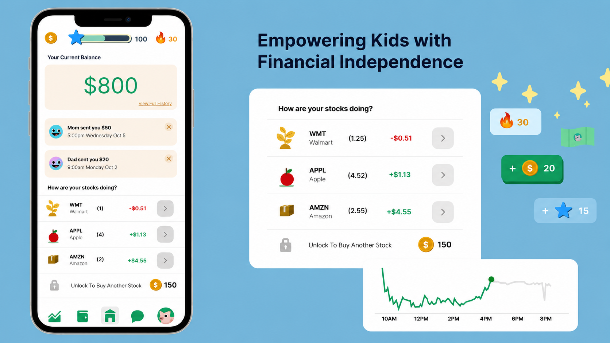
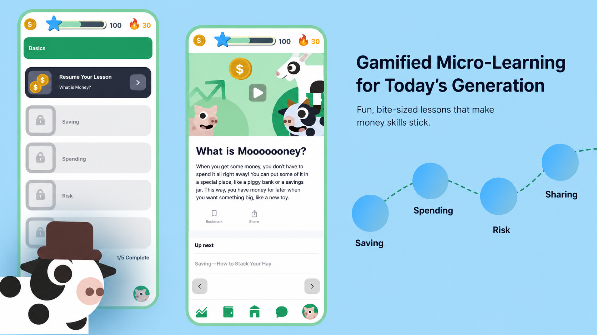
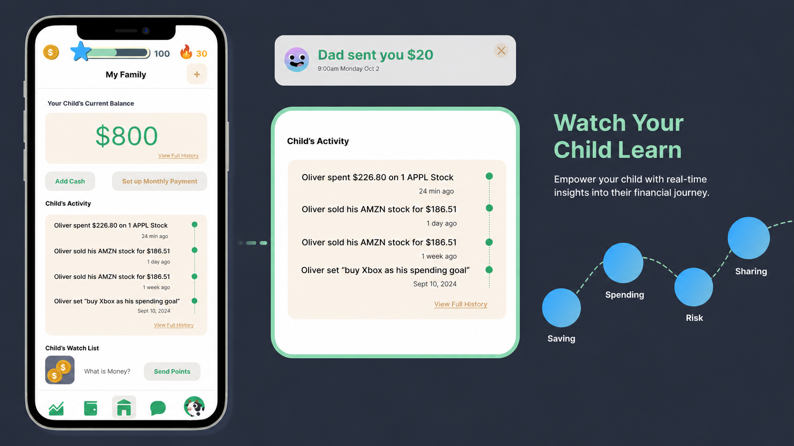
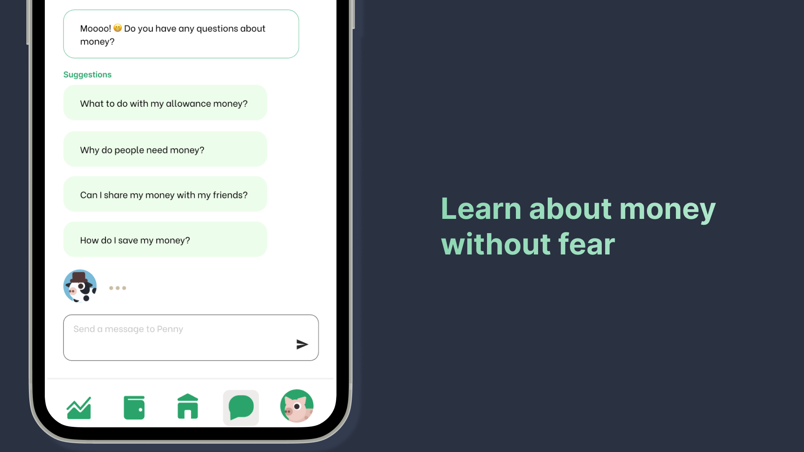
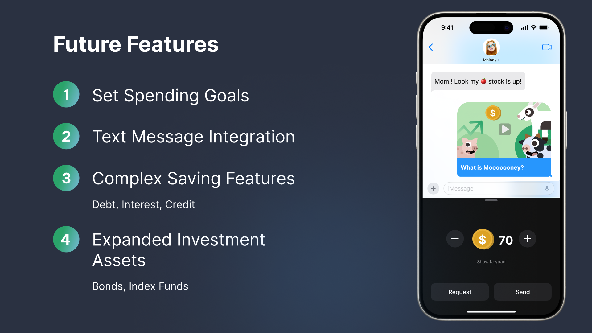

# 🔗 LittleInvestors — Parent-Controlled Financial Education Powered by Stellar & Soroban


## 🎯 What is LittleInvestors?

LittleInvestors helps children learn financial literacy through real blockchain interactions. Parents fund a learning vault, set spending limits, and reward educational milestones. Children learn by earning, saving, and managing digital assets through real Stellar transactions.

Every lesson becomes a real on-chain experience. When lessons or quizzes are completed, rewards (custom educational reward assets and testnet funds) are released from the learning vault or platform treasury to the child's account. All transactions are recorded on the Stellar blockchain and can be viewed through a blockchain explorer.

### ⭐ Key Innovation: Parent-Controlled Learning Vault
Parents create a Soroban-powered learning vault that allows children to perform real blockchain transactions while enforcing spending limits, savings goals, and educational milestones.

---

## 🌟 Features

| Feature | Description |
|---|---|
| 🏠 **Dashboard** | Real-time portfolio view with animated balance, token holdings, and asset explorer |
| 📚 **5 Web3 Lessons** | Video-based lessons with XP rewards: Blockchain, Cryptography, Coins/Wallets, Consensus, and Smart Contracts |
| 🏆 **Quiz System** | 3-question quizzes after each lesson, with confetti on perfect scores |
| 🤖 **AI Blockchain Coach** | Powered by Google Gemini — kid-friendly, interactive answers to blockchain questions |
| 👨‍👩‍👧 **Parent Dashboard** | Parents connect Freighter wallet to fund and deploy a Soroban learning vault |
| 📈 **Asset Explorer** | Learn how digital assets work by managing XLM and educational reward tokens |
| 📈 **Live Trend Sparklines** | Dynamic inline SVG sparkline graphs rendering real Yahoo Finance 5-day historical trend lines |
| 📰 **Blockchain News Feed** | A curated stream of decentralized ecosystem updates displayed directly on the dashboard |
| 🎖️ **Achievements** | 7 validator achievement badges: Baby Satoshi, Super HODLer, Level Up, and more |
| 🔥 **Streak System** | Daily learning streak tracking + XP validator progression system |

---

## 🚀 Demo

**Live app:** https://little-investors-delta.vercel.app/

**Demo video:** [YouTube](#)

**Devpost submission:** [Link](#)

### Screenshots

<table>
  <tr>
    <td><b>Landing Page</b></td>
    <td><b>Dashboard</b></td>
    <td><b>Courses</b></td>
  </tr>
  <tr>
    <td></td>
    <td></td>
    <td></td>
  </tr>
  <tr>
    <td><b>Quiz</b></td>
    <td><b>AI Chatbot</b></td>
    <td><b>Parent Mode</b></td>
  </tr>
  <tr>
    <td></td>
    <td></td>
    <td></td>
  </tr>
</table>

---

## 🛠️ Tech Stack

- **Blockchain:** Stellar SDK + Soroban Smart Contracts (Rust)
- **Wallet Integration:** Freighter Wallet
- **Backend:** Node.js + Express
- **Frontend:** EJS templates + Vanilla CSS + Vanilla JS
- **AI:** Google Gemini 2.5 Flash API
- **Analytics:** Novus.ai
- **Storage:** localStorage (client-side state) + Stellar Ledger
- **Deployment:** Railway

---

## 🏃 Run Locally

```bash
git clone https://github.com/thesumedh/Little-Investors.git
cd Little-Investors
npm install
# Add GEMINI_API_KEY to src/.env
npm start
# Open http://localhost:3000
```

### Environment Variables (`src/.env`)
```
PORT=3000
GEMINI_API_KEY=your_key_here  # Get free at aistudio.google.com
NOVUS_TOKEN=your_token_here   # Get at novus.ai
```

---

## 📖 What I Built, Who It's For, What I Learned

**What I built:** A mobile-first Web3 learning portal that turns blockchain education into a collaborative game for families. Instead of reading whitepapers, kids learn by managing real-scaled digital assets and educational reward tokens after completing lessons, while parents fund smart-contract learning vaults using their Freighter wallet.

**Who it's for:** Parents who want to give their children a head start in Web3 and cryptocurrency, especially in underrepresented communities. Kids aged 8–16 who learn best by hands-on experimentation.

**Tools used:** Built with Stellar/Soroban (Rust), Freighter wallet integration, Node.js/Express, styled with pure CSS, AI powered by Google Gemini, analytics via Novus.ai.

**What I learned:** The parent-child dynamic is the product's superpower. The moment you make blockchain learning a shared escrow milestone (learn-to-earn) rather than individual homework, participation and motivation transform.

---

## 🔮 What's Next

- Mainnet deployment of Soroban allowance contracts
- Multi-signature vault setups for both parents to approve chores
- iMessage integration for family allowance push notifications
- Expanded DeFi concepts (staking, liquidity pools)
- Teacher mode for classrooms and clubs

---

## 🧗 Challenges

- **Gemini API for kids**: Getting the AI to consistently give age-appropriate answers required careful system prompting and temperature tuning
- **State without a database**: Using localStorage for all game state required careful design of the data model
- **The parent-child UX split**: Designing one app that serves two very different user types (parent + child) without being confusing for either

