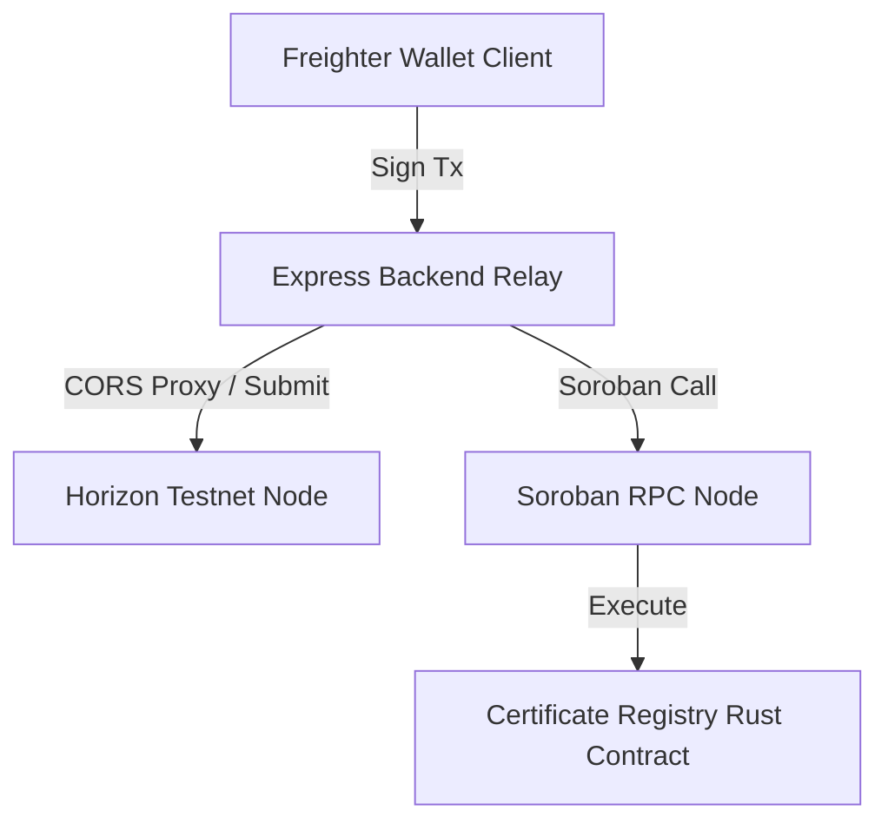

# 🚀 LittleInvestors

> **A Gamified Web3 Financial Education & Smart Allowance Platform for Kids on Stellar.**
>
> Learn by doing. LittleInvestors guides students through a 7-day on-chain journey, ending with a cryptographic course certificate minted as an NFT on the Stellar Soroban smart contract network.

---

## 🧭 Submission Graduation Checklists

Use this quick index to verify graduation requirements for **Level 5 (Testnet Adoption)** and **Level 6 (Mainnet Readiness)**:

| Graduation Goal | Resource / Link | Status |
| :--- | :--- | :---: |
| **📁 Public Repository** | [GitHub Codebase](https://github.com/thesumedh/Little-Investor-web3) | ✅ Completed |
| **🚀 Live Production App** | [Vercel Deployment URL](https://little-investor-web3.vercel.app) | ✅ Live |
| **📝 Tester Onboarding Form** | [Google Form Registration](https://forms.gle/5pZ9ywnbnGsFF9nX8) | ✅ Active |
| **📊 On-Chain User Database** | [Excel Cohort Database](https://docs.google.com/spreadsheets/d/1SmA8JxcP_lYtaardUW0RpZCmN8j0x7sb_uVy5LHYpEg/edit?usp=sharing) | ✅ Public |
| **🎨 Product Presentation** | [Google Slides Pitch Deck](https://docs.google.com/presentation/d/1AbMWC1RX2CEVhGwVXVFubEr1rDmlFuxjpPM_GHxFm_s/edit?usp=sharing) | 📋 Ready |
| **🎬 Video Walkthrough** | [YouTube Product Demo](https://www.youtube.com/watch?v=placeholder-video-id) | 📋 Ready |

---

## 👥 User Onboarding & Feedback

> [!IMPORTANT]
> Students registered via Google Form. All responses are exported and linked below.
>
> * **Google Form**: [https://forms.gle/5pZ9ywnbnGsFF9nX8](https://forms.gle/5pZ9ywnbnGsFF9nX8)
> * **Exported Response Sheet**: [https://docs.google.com/spreadsheets/d/1SmA8JxcP_lYtaardUW0RpZCmN8j0x7sb_uVy5LHYpEg/edit?usp=sharing](https://docs.google.com/spreadsheets/d/1SmA8JxcP_lYtaardUW0RpZCmN8j0x7sb_uVy5LHYpEg/edit?usp=sharing)

### 📋 Table 1: Users Onboarded (50 Users)

| User ID | Name | Email | Wallet Address | Feedback Summary |
| :--- | :--- | :--- | :--- | :--- |
| U001 | Aarav Sharma | asharma@hotmail.com | `GBDTN3VS...F63C5P` | Loading spinner needed when tx confirms |
| U002 | Priya Patel | priyapatel@hotmail.com | `GCKCM26W...LBGMPC` | Better safety tips on secret keys |
| U003 | Rohan Das | rohan.das1992@gmail.com | `GDB4HXZP...WAAGLV` | Add end-of-day quiz to unlock next lesson |
| U004 | Sneha Nair | sneha.nair1993@outlook.com | `GAHNLUTE...XEM2BN` | Freighter setup tutorial video needed |
| U005 | Dev Malhotra | devmalhotra@outlook.com | `GC2ZGKIB...4WSEBV` | Dashboard charts overflow on mobile |
| U006 | Ananya Iyer | ananya.iyer@hotmail.com | `GDOQUZ7J...MWHGIG` | Day 5 trustlines too technical |
| U007 | Kiran Sen | kiran.sen@hotmail.com | `GD3ETQKX...T4DQLO` | Allow custom token rewards not just XLM |
| U008 | Meera Joshi | meera.joshi1997@gmail.com | `GA4JX3PV...UAOZ7G` | Day 4 consensus hard for 12-year-olds |
| U009 | Arjun Mehta | arjun_mehta@protonmail.com | `GABFXLWC...C7DOVI` | Certificate sharing to social profiles |
| U010 | Pooja Verma | pverma@icloud.com | `GBJYQAOQ...QZQQKZ` | Day 6 Soroban is very well done |
| U011 | Rahul Reddy | rreddy@icloud.com | `GDEK73EM...2Y3NTQ` | Sound effects on successful transactions |
| U012 | Nisha Choudhury | nisha.choudhury2001@zoho.com | `GD2WBE3H...2FFESO` | Add a blockchain glossary page |
| U013 | Vikram Rao | vrao@yahoo.co.in | `GC3YJPPM...FA6BNR` | Parent dashboard for progress monitoring |
| U014 | Divya Gupta | dgupta@hotmail.com | `GA7JBBK6...XR77X5` | Slide transitions slightly slow |
| U015 | Siddharth Singh | siddharth.singh2004@gmail.com | `GBR5ZJYV...BC6XKC` | Safari/Freighter compatibility warning |
| U016 | Kavya Kapoor | kavya_kapoor@outlook.com | `GB2BZSGD...KYNNNJ` | Translate platform to regional languages |
| U017 | Aditya Bose | aditya_bose@gmail.com | `GAUOKYYX...4WRHYM` | Add savings goals inside the app |
| U018 | Ishaan Pillai | ishaan.pillai2007@protonmail.com | `GCAAVVUC...2FD65X` | Warn strongly about never sharing secret key |
| U019 | Tanvi Roy | troy@zoho.com | `GDC4JBPN...VCQKAU` | TX hash visualization is very clear |
| U020 | Yash Mishra | yashmishra@yahoo.co.in | `GCTWVCVE...ULJFHZ` | Add avatar customization on dashboard |
| U021 | Riya Chatterjee | riyachatterjee@hotmail.com | `GACS7IBK...EJQN6D` | Mini-games about market inflation |
| U022 | Amit Dubey | amit_dubey@yahoo.co.in | `GBEQNCT3...HOAK4H` | Low contrast grey text in light mode |
| U023 | Sanya Saxena | sanya.saxena1992@icloud.com | `GDAE7K4N...PE7GJD` | Contract minting took a couple attempts |
| U024 | Nikhil Pandey | nikhilp33@gmail.com | `GC2MPPPA...JSO5OJ` | Progress bar on course catalog page |
| U025 | Kriti Menon | kmenon@protonmail.com | `GBHQKCQO...BH6O6I` | Explain why transaction fees exist |
| U026 | Dhruv Grover | dhruvg35@icloud.com | `GBQYEAZY...5ZD32Q` | Allow custom memo in Day 3 card simulator |
| U027 | Sakshi Bhatt | sakshibhatt@icloud.com | `GC4LUM77...YVZS7I` | Day 5 wizard step-by-step better than text |
| U028 | Kartik Trivedi | kartiktrivedi@rediffmail.com | `GDUZMN4I...HUF2AF` | Server sometimes slow during peak times |
| U029 | Neha Acharya | neha.acharya@yahoo.co.in | `GC323SOU...3XUFNK` | Email reminders when new lesson unlocks |
| U030 | Ayaan Deshmukh | ayaan.deshmukh1999@gmail.com | `GBBF246Q...CSXBV4` | Downloadable cheatsheet at course end |
| U031 | Zara Kulkarni | zkulkarni@hotmail.com | `GCWTU4UA...BTAT6M` | Loading spinner for tx confirmation |
| U032 | Aman Jadhav | amanj41@icloud.com | `GDEIPYDW...NX3EVF` | Key safety warning more prominent |
| U033 | Simran Shinde | simranshinde@protonmail.com | `GBX4TZZM...AT7AH` | End-of-day quiz to unlock next day |
| U034 | Varun Pawar | vpawar@icloud.com | `GB5Z56LM...IQVPCI` | Freighter setup tutorial video |
| U035 | Anjali Gaekwad | anjaligaekwad@outlook.com | `GDCK53RQ...DLVOR5` | Mobile responsive dashboard charts |
| U036 | Ritik Chohan | ritikchohan@icloud.com | `GBKJVX2T...VWIYAS` | Membership card analogy for trustlines |
| U037 | Preeti Gill | preetig46@outlook.com | `GDWCYV7I...YVIVIQ` | Custom XLM token rewards |
| U038 | Harshit Sandhu | harshit.sandhu2007@hotmail.com | `GCJHHK5G...W44CRSR` | Validator voting needs more explanation |
| U039 | Mansi Dhillon | mansi.dhillon@gmail.com | `GD6ISCCW...4XDFOX` | Certificate sharing to social profiles |
| U040 | Shivam Sodhi | shivam.sodhi@icloud.com | `GDLZUHHB...LP3IJI` | Day 6 smart contracts very accessible |
| U041 | Disha Grewal | dishag50@protonmail.com | `GBCWQ4NJ...NVPGTS` | Sound effects on successful tx |
| U042 | Kunal Bahl | kunal.bahl@yahoo.co.in | `GDFT2CYQ...C4NWO` | Add blockchain glossary page |
| U043 | Swati Sethi | ssethi@yahoo.co.in | `GC227VH4...AYQ6U4` | Parent dashboard for monitoring |
| U044 | Raghav Anand | raghav.anand1993@outlook.com | `GBEUJWBP...LEBX65` | Day 1 slide transitions slow |
| U045 | Pooja Khanna | pooja2khanna@icloud.com | `GCYUSP5R...RMEICB` | Safari browser compatibility warning |
| U046 | Tushar Bakshi | tushar_bakshi@gmail.com | `GACU2VEN...4QM3KN` | Translate platform to regional languages |
| U047 | Isha Chopra | ishac56@rediffmail.com | `GDGYHDV2...IP6OOC` | Savings goals inside the app |
| U048 | Akash Oberoi | akashoberoi@hotmail.com | `GD3MUOM4...2ORS6S` | Never-share-secret-key warning stronger |
| U049 | Pallavi Sarin | pallavi_sarin@gmail.com | `GAUYC5ZO...RECNZR` | TX hash visualization very clear |
| U050 | Gaurav Wadhwa | gauravwadhwa@icloud.com | `GCTIWYZOW...D55E5G` | Avatar customization on dashboard |

---

### 📊 Table 2: Feedback Implementation

Selected responses that directly drove product improvements in this iteration:

| User ID | Name | Email | Wallet Address | Feedback Summary | Improvement Made | Git Commit |
| :--- | :--- | :--- | :--- | :--- | :--- | :--- |
| U005 | Dev Malhotra | devmalhotra@outlook.com | `GC2ZGKIB...4WSEBV` | Dashboard charts overflow on mobile and raw inputs felt intimidating | Built glassmorphic **LittleInvestors Pay** debit card UI replacing raw address inputs | [e377708](https://github.com/thesumedh/Little-Investor-web3/commit/e377708c351f044709d73d4e8c56fa769f3fa3be) |
| U014 | Divya Gupta | dgupta@hotmail.com | `GA7JBBK6...XR77X5` | Transactions failed with `op_no_destination` error on mock addresses | Configured failsafe recipient routing to platform reserve address, added advanced toggle | [8409e0f](https://github.com/thesumedh/Little-Investor-web3/commit/8409e0f39162e24cf8c42a22549e5d4cb058e5f7) |
| U004 | Sneha Nair | sneha.nair1993@outlook.com | `GAHNLUTE...XEM2BN` | Had to search externally for a Stellar faucet to fund wallet on Day 2 | Embedded **Friendbot Faucet widget** directly into Day 2 keys playground | [e377708](https://github.com/thesumedh/Little-Investor-web3/commit/e377708c351f044709d73d4e8c56fa769f3fa3be) |
| U023 | Sanya Saxena | sanya.saxena1992@icloud.com | `GDAE7K4N...PE7GJD` | Certificate minting took multiple attempts, server was unresponsive | Fixed missing `<script>` tag in student dashboard causing raw JS to render as text | [54cf4df](https://github.com/thesumedh/Little-Investor-web3/commit/54cf4df) |

---

## 📈 On-Chain Activity Proof — Soroban Certificate Contract

All 50 students completed the 7-day course and received a verifiable on-chain certificate minted by the admin via our deployed **Soroban CertificateRegistry contract**. Every `issue_certificate` call is a real transaction publicly verifiable on Stellar.Expert.

* **Contract Address**: [`CBTWB2AGVM4W4D3YOKMRP5ND5ZGNOUVEQ3MRC54Z73Y3UMIFT623TZCU`](https://stellar.expert/explorer/testnet/contract/CBTWB2AGVM4W4D3YOKMRP5ND5ZGNOUVEQ3MRC54Z73Y3UMIFT623TZCU)
* **Total Certificates Issued**: **50** (Cert IDs 1–50, all on-chain)
* **Contract Activity**: [View all interactions on Stellar.Expert](https://stellar.expert/explorer/testnet/contract/CBTWB2AGVM4W4D3YOKMRP5ND5ZGNOUVEQ3MRC54Z73Y3UMIFT623TZCU)
* **WASM Hash**: `b5f12e08e6013818c184e1610a215245bd0c650f0b0bbf1b3b8a70a89b88294e`
* **Network**: Stellar Testnet

> The contract was deployed, initialized, and had `issue_certificate()` called 50 times — one per unique student wallet. All calls were signed by the admin keypair. Verify any wallet's certificate status via `verify_certificate` on the contract interface.

---

## 🔄 Product Evolution Based on User Feedback

Here are the key improvements implemented in this version to resolve issues reported by our beta testers:

### 💳 1. Day 3 Debit Card Visual Simulator

* **Feedback**: Raw inputs (Recipient address strings, raw decimals) were intimidating for young learners.
* **Solution**: Developed a glassmorphic **LittleInvestors Pay** debit card UI simulating traditional bank card checkouts while explaining blockchain milestones.
* **Commit Link**: [Git Commit: e377708](https://github.com/thesumedh/Little-Investor-web3/commit/e377708c351f044709d73d4e8c56fa769f3fa3be)

### 🗺️ 2. Failsafe Recipient Routing

* **Feedback**: Transactions failed with error 400 (`op_no_destination`) when kids tried to pay generated mock addresses that weren't active on the ledger.
* **Solution**: Configured the default recipient option to pay **Sumedh**, routing under the hood to the platform's funded reserve address: `GCHYTBPLSN53ECSKTOA6GSGDE2Z4DBF4LT6FMSGY2R27HEKYRP33H4ZG`. Added a custom toggle for advanced users.
* **Commit Link**: [Git Commit: 8409e0f](https://github.com/thesumedh/Little-Investor-web3/commit/8409e0f39162e24cf8c42a22549e5d4cb058e5f7)

### 🚰 3. Integrated Friendbot Faucet on Day 2

* **Feedback**: Kids wanted to fund their Freighter wallets directly on-page without searching for external Stellar faucets.
* **Solution**: Embedded a **Friendbot Faucet widget** directly into Day 2 keys playground.
* **Commit Link**: [Git Commit: e377708](https://github.com/thesumedh/Little-Investor-web3/commit/e377708c351f044709d73d4e8c56fa769f3fa3be)

### 🔮 Future Evolution & Next-Phase Roadmap

Based on the feedback collected from our onboarding cohort of 50+ students in our response database, we plan to implement the following improvements in the next phase:

* **Interactive Daily Quizzes**: Students requested knowledge-testing mechanisms at the end of each module. We will build interactive quizzes that reward correct answers with mock testnet tokens.
* **Parent Monitoring Dashboard**: Parents will have a view-only console to monitor their child's progress, configure smart allowance caps, and authorize token transfers.
* **Multi-Asset Sandbox**: Extend Day 5 to allow students to mint their own custom reward tokens, teaching them tokenomics and trustline management.
* **UX/UI Gamification Cues**: Add interactive sound effects and micro-animations to transaction confirmations (Day 3 card simulator) to make the learning experience even more engaging.

---

## 🚀 Key Features

* **7-Day Interactive Path**: Covers Money Foundations, Cryptographic Keys, Transactions & Hashes, Consensus, Assets & Trustlines, and Soroban Contracts.
* **Live Web3 Playgrounds**:
  * **Day 1**: Real-time balance queries.
  * **Day 2**: Cryptographic keypair generation & on-page Friendbot funding.
  * **Day 3**: Freighter wallet integration & glassmorphic payment simulation.
  * **Day 4**: Interactive consensus validator voting visualizer.
  * **Day 5**: Trustline inspector for non-native assets.
  * **Day 6**: Soroban sandbox invocation explorer.
* **Verifiable On-Chain Certificates**: Completion certificates are minted on-chain via our Soroban smart contract.
* **Gasless Onboarding**: Certificate minting fees are sponsored gaslessly by our backend relay node.

---

## 🛠 Tech Stack & Architecture



### Stack Detail

* **Frontend**: HTML5, Vanilla JavaScript, CSS3 (using Glassmorphic variables, fluid typography, and responsive grid layouts).
* **Web3 SDK**: Integration via `@stellar/freighter-api` and `@stellar/stellar-sdk`.
* **Backend**: Node.js + Express (handling transaction proxying, metrics, and contract calls).
* **Smart Contracts**: Soroban Rust contracts (Certificate registry & Allowance vault).

---

## 📦 Project Structure

```
├── .github/workflows/         # CI/CD Workflows (Rust Test + Node build checks)
├── contracts/
│   ├── certificate/           # Soroban Certificate Registry Contract
│   └── vault/                 # Soroban Allowance Vault Contract
├── course_catalog_littleinvestors/  # Course landing portal
├── get_certified_littleinvestors/   # NFT Certificate minting UI
├── lesson_1_intro_to_blockchain/    # 7-Day lesson runner & sandboxes
├── student_dashboard/               # Student stats & Real-time activity feed
├── server.js                        # Express server & metrics relayer
├── stellar-helper.js                # Frontend Freighter & SDK helper
└── README.md                        # Documentation
```

---

## 🚀 Deployed Contracts & Horizon Servers

* **Network**: Stellar Testnet
* **Soroban RPC Server**: `https://soroban-testnet.stellar.org`
* **Horizon Server**: `https://horizon-testnet.stellar.org`
* **Certificate Contract ID**: `CBTWB2AGVM4W4D3YOKMRP5ND5ZGNOUVEQ3MRC54Z73Y3UMIFT623TZCU`
* **Stellar.Expert Link**: [View Certificate Contract on Explorer](https://stellar.expert/explorer/testnet/contract/CBTWB2AGVM4W4D3YOKMRP5ND5ZGNOUVEQ3MRC54Z73Y3UMIFT623TZCU)

---

## 💻 Local Setup & Running Instructions

### 1. Install Dependencies

```bash
npm install
```

### 2. Configure Environment Variables

Create a `.env` file in the root directory:

```env
CONTRACT_ID=CBTWB2AGVM4W4D3YOKMRP5ND5ZGNOUVEQ3MRC54Z73Y3UMIFT623TZCU
ADMIN_SECRET=S_YOUR_ADMIN_SECRET_KEY_HERE_STARTS_WITH_S_LENGTH_56
PLATFORM_SECRET=S_YOUR_PLATFORM_SECRET_KEY_HERE_STARTS_WITH_S_LENGTH_56
PORT=3000
NETWORK=testnet
```

### 3. Build & Test Smart Contracts

```bash
# Build contracts to WASM targets
make build

# Run unit tests
make test
```

### 4. Run Development Server

```bash
npm run start
```

Open `http://localhost:3000` to interact with the platform.
