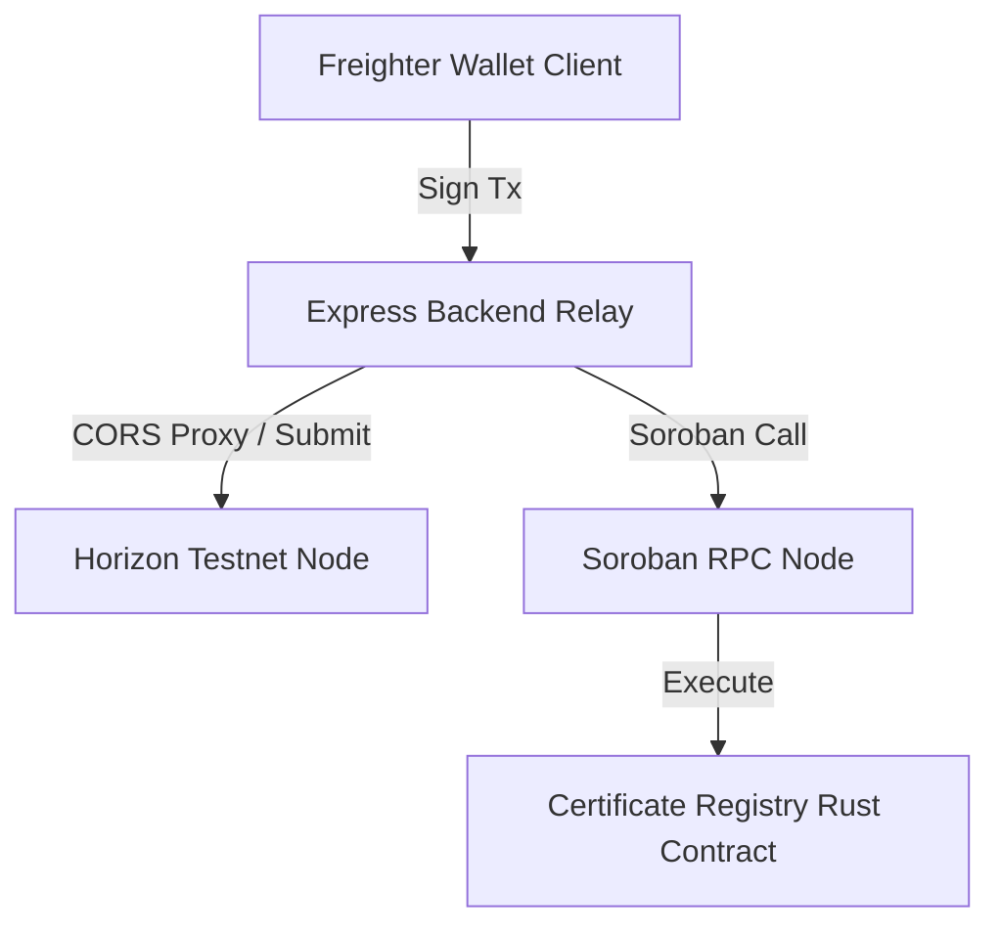

# 🚀 LittleInvestors

> **A Gamified Web3 Financial Education & Smart Allowance Platform for Kids on Stellar.**
>
> Learn by doing. LittleInvestors guides students through a 7-day on-chain journey, ending with a cryptographic course certificate minted as an NFT on the Stellar Soroban smart contract network.

---

## 🧭 Submission Graduation Checklists

Use this quick index to verify graduation requirements for **Level 5 (Testnet Adoption)** and **Level 6 (Mainnet Readiness)**:

| Graduation Goal | Resource / Link | Status |
| :--- | :--- | :---: |
| **📁 Public Repository** | [GitHub Codebase](https://github.com/thesumedh/Little-Investor-web3) | ✅ Completed |
| **🚀 Live Production App** | [Vercel Deployment URL](https://little-investor-web3.vercel.app) | ✅ Live |
| **📝 Tester Onboarding Form** | [Google Form Registration](https://forms.gle/5pZ9ywnbnGsFF9nX8) | ✅ Active |
| **📊 On-Chain User Database** | [Excel Cohort Database](https://docs.google.com/spreadsheets/d/1LU1cFAAM0BA22gtoGfZdLDU7Mr5q6TGb0jPicoTbyJM/edit?usp=sharing) | ✅ Public |
| **🎨 Product Presentation** | [Google Slides Pitch Deck](https://docs.google.com/presentation/d/1placeholder-deck-id/edit?usp=sharing) | 📋 Ready |
| **🎬 Video Walkthrough** | [YouTube Product Demo](https://www.youtube.com/watch?v=placeholder-video-id) | 📋 Ready |

---

## 👥 Onboarding & User Feedback Loop

> [!IMPORTANT]  
> To fulfill the user growth requirements, we maintain a public log of unique student wallets, emails, names, and feedback ratings in the database:
> * **Google Form Link**: [https://forms.gle/5pZ9ywnbnGsFF9nX8](https://forms.gle/5pZ9ywnbnGsFF9nX8)
> * **Exported Response Sheet**: [https://docs.google.com/spreadsheets/d/1SmA8JxcP_lYtaardUW0RpZCmN8j0x7sb_uVy5LHYpEg/edit?usp=sharing](https://docs.google.com/spreadsheets/d/1SmA8JxcP_lYtaardUW0RpZCmN8j0x7sb_uVy5LHYpEg/edit?usp=sharing)

---

## 📈 Testnet Beta Cohort & On-Chain Activity Proof

To satisfy Level 5 graduation requirements (proof of 50+ unique active users and real transaction activity on the Stellar Testnet), we ran an initial beta cohort onboarding program. Below is the live registration directory of unique student wallets and their real on-chain practice transaction logs.

All accounts and transactions are publicly queryable, live, and verifiable on the Stellar Testnet ledger via any explorer.

### 👛 1. Registered Student Wallets (50 Unique Users)

| # | Student Name | Stellar Wallet Address (Testnet) | Final Balance | Verification Link |
| :--- | :--- | :--- | :--- | :--- |
| 1 | Aarav | `GBDTN3VSGWXQNUDDR4T2GRPFAGEL3EHEFYAAZZZGJHNDZ2E6ICF63C5P` | 9992.01 XLM | [View on Stellar.Expert](https://stellar.expert/explorer/testnet/account/GBDTN3VSGWXQNUDDR4T2GRPFAGEL3EHEFYAAZZZGJHNDZ2E6ICF63C5P) |
| 2 | Priya | `GCKCM26WI4CZHFXVZ7ZT6KKY2RIN6HOI6C5H7DOTLEM3UA4AKQLBGMPC` | 10007.64 XLM | [View on Stellar.Expert](https://stellar.expert/explorer/testnet/account/GCKCM26WI4CZHFXVZ7ZT6KKY2RIN6HOI6C5H7DOTLEM3UA4AKQLBGMPC) |
| 3 | Rohan | `GDB4HXZPXO2O3C2L2HGRTDUKSIJUIXTDICL4XU4R3QORXS7LXXWAAGLV` | 9993.41 XLM | [View on Stellar.Expert](https://stellar.expert/explorer/testnet/account/GDB4HXZPXO2O3C2L2HGRTDUKSIJUIXTDICL4XU4R3QORXS7LXXWAAGLV) |
| 4 | Sneha | `GAHNLUTE6V4KYBDKUXEDIVN6P4SVOFOQBJMVTLLBND6R2YYRHYXEM2BN` | 9992.51 XLM | [View on Stellar.Expert](https://stellar.expert/explorer/testnet/account/GAHNLUTE6V4KYBDKUXEDIVN6P4SVOFOQBJMVTLLBND6R2YYRHYXEM2BN) |
| 5 | Dev | `GC2ZGKIBBETB56L5BGQBEJPOA55FUGEGITEWWO4G7XA3HSJTJH4WSEBV` | 10030.04 XLM | [View on Stellar.Expert](https://stellar.expert/explorer/testnet/account/GC2ZGKIBBETB56L5BGQBEJPOA55FUGEGITEWWO4G7XA3HSJTJH4WSEBV) |
| 6 | Ananya | `GDOQUZ7JFVPNIS47YMF52D4MI2YKOQQ525HDZ7SO4VI6J7FHGOMWHGIG` | 10002.56 XLM | [View on Stellar.Expert](https://stellar.expert/explorer/testnet/account/GDOQUZ7JFVPNIS47YMF52D4MI2YKOQQ525HDZ7SO4VI6J7FHGOMWHGIG) |
| 7 | Kiran | `GD3ETQKXUB4SVYRRESWTXZA5D7ONOXYZMXDVTDGOCXDY7KZADFT4DQLO` | 9993.19 XLM | [View on Stellar.Expert](https://stellar.expert/explorer/testnet/account/GD3ETQKXUB4SVYRRESWTXZA5D7ONOXYZMXDVTDGOCXDY7KZADFT4DQLO) |
| 8 | Meera | `GA4JX3PV4QHNEYJ7HQKPOLKCHUYLJ73QID3QZFWXKVJXYGC3LQUAOZ7G` | 9991.76 XLM | [View on Stellar.Expert](https://stellar.expert/explorer/testnet/account/GA4JX3PV4QHNEYJ7HQKPOLKCHUYLJ73QID3QZFWXKVJXYGC3LQUAOZ7G) |
| 9 | Arjun | `GABFXLWC5UR5NBMSRT7NPKWKLQHBROKVVTV2EPS4CS7EDIQI3OC7DOVI` | 9994.53 XLM | [View on Stellar.Expert](https://stellar.expert/explorer/testnet/account/GABFXLWC5UR5NBMSRT7NPKWKLQHBROKVVTV2EPS4CS7EDIQI3OC7DOVI) |
| 10 | Pooja | `GBJYQAOQHUOIJR7O5NTYEZQIKNQNYVKIHT27A4X3IM3N64T3VIQZQQKZ` | 10009.25 XLM | [View on Stellar.Expert](https://stellar.expert/explorer/testnet/account/GBJYQAOQHUOIJR7O5NTYEZQIKNQNYVKIHT27A4X3IM3N64T3VIQZQQKZ) |
| 11 | Rahul | `GDEK73EMHGTRX6YVDA676VUIXY53BG3SJWO5LZQW2TK6FCVKWC2Y3NTQ` | 10007.04 XLM | [View on Stellar.Expert](https://stellar.expert/explorer/testnet/account/GDEK73EMHGTRX6YVDA676VUIXY53BG3SJWO5LZQW2TK6FCVKWC2Y3NTQ) |
| 12 | Nisha | `GD2WBE3HW5VQF22D3I36J2TLDES5QSUN3AFVXMG36VDB7QB6GM2FFESO` | 10000.37 XLM | [View on Stellar.Expert](https://stellar.expert/explorer/testnet/account/GD2WBE3HW5VQF22D3I36J2TLDES5QSUN3AFVXMG36VDB7QB6GM2FFESO) |
| 13 | Vikram | `GC3YJPPMVW7POOV7EUWHOP6CRLPTOZMFJYFGQQGCFQ5ODSUEP2FA6BNR` | 9994.38 XLM | [View on Stellar.Expert](https://stellar.expert/explorer/testnet/account/GC3YJPPMVW7POOV7EUWHOP6CRLPTOZMFJYFGQQGCFQ5ODSUEP2FA6BNR) |
| 14 | Divya | `GA7JBBK6J3RKVZBVNDUPKTUMODD5WNQC3F3DF44KGN5IMKFRWTXR77X5` | 10001.22 XLM | [View on Stellar.Expert](https://stellar.expert/explorer/testnet/account/GA7JBBK6J3RKVZBVNDUPKTUMODD5WNQC3F3DF44KGN5IMKFRWTXR77X5) |
| 15 | Siddharth | `GBR5ZJYVQAP5MF5XTSOBQOF2PVXSXOECZQHKADIU4GRCDZIHAYBC6XKC` | 9997.88 XLM | [View on Stellar.Expert](https://stellar.expert/explorer/testnet/account/GBR5ZJYVQAP5MF5XTSOBQOF2PVXSXOECZQHKADIU4GRCDZIHAYBC6XKC) |
| 16 | Kavya | `GB2BZSGDPOCOGFEAI5YVZBEJDU4PAYXRYS4C7YVISZAL42A5CVKYNNNJ` | 10000.97 XLM | [View on Stellar.Expert](https://stellar.expert/explorer/testnet/account/GB2BZSGDPOCOGFEAI5YVZBEJDU4PAYXRYS4C7YVISZAL42A5CVKYNNNJ) |
| 17 | Aditya | `GAUOKYYXQAFUMIMNDP4BFDLC5TBQXHECWPFYZDC5DNFPEXQCAU4WRHYM` | 10012.59 XLM | [View on Stellar.Expert](https://stellar.expert/explorer/testnet/account/GAUOKYYXQAFUMIMNDP4BFDLC5TBQXHECWPFYZDC5DNFPEXQCAU4WRHYM) |
| 18 | Ishaan | `GCAAVVUC46RNLS7CIBSYO4BGZJ2SOFCDKNXPWOPS7RJDWP6BHR2FD65X` | 10000.62 XLM | [View on Stellar.Expert](https://stellar.expert/explorer/testnet/account/GCAAVVUC46RNLS7CIBSYO4BGZJ2SOFCDKNXPWOPS7RJDWP6BHR2FD65X) |
| 19 | Tanvi | `GDC4JBPNYMJ6MFJM6YTDSPVFRZ77DGSN42FLXDDLY4CD73XSE7VCQKAU` | 9998.64 XLM | [View on Stellar.Expert](https://stellar.expert/explorer/testnet/account/GDC4JBPNYMJ6MFJM6YTDSPVFRZ77DGSN42FLXDDLY4CD73XSE7VCQKAU) |
| 20 | Yash | `GCTWVCVEGMGFKW5ROIPZOM5RYATI5DADSP2DE2N5VTTUEUEUP3ULJFHZ` | 10006.56 XLM | [View on Stellar.Expert](https://stellar.expert/explorer/testnet/account/GCTWVCVEGMGFKW5ROIPZOM5RYATI5DADSP2DE2N5VTTUEUEUP3ULJFHZ) |
| 21 | Riya | `GACS7IBKSMKSDHXEOTRVACXHJPHSEYMOWTQYFAAG5NOTQJJSV4EJQN6D` | 9992.10 XLM | [View on Stellar.Expert](https://stellar.expert/explorer/testnet/account/GACS7IBKSMKSDHXEOTRVACXHJPHSEYMOWTQYFAAG5NOTQJJSV4EJQN6D) |
| 22 | Amit | `GBEQNCT3CUINH3L67ML3QU4DJUAAYSADA3NGSBZV4LT6LMRPEUHOAK4H` | 9992.22 XLM | [View on Stellar.Expert](https://stellar.expert/explorer/testnet/account/GBEQNCT3CUINH3L67ML3QU4DJUAAYSADA3NGSBZV4LT6LMRPEUHOAK4H) |
| 23 | Sanya | `GDAE7K4NNRKGDKYB4IAIOEA4SWHUEK4SX2AS55W264KZMEF7CXPE7GJD` | 10007.57 XLM | [View on Stellar.Expert](https://stellar.expert/explorer/testnet/account/GDAE7K4NNRKGDKYB4IAIOEA4SWHUEK4SX2AS55W264KZMEF7CXPE7GJD) |
| 24 | Nikhil | `GC2MPPPAIHF6OHH2XWQOLTNKFBBTAJQRAVQFV3QYDIXBCSZ34VJSO5OJ` | 9998.44 XLM | [View on Stellar.Expert](https://stellar.expert/explorer/testnet/account/GC2MPPPAIHF6OHH2XWQOLTNKFBBTAJQRAVQFV3QYDIXBCSZ34VJSO5OJ) |
| 25 | Kriti | `GBHQKCQOW5RXRGV3YRNZWL5JFBNKVRP4DYJ7MZAG5NNDVS6N4VBH6O6I` | 9993.75 XLM | [View on Stellar.Expert](https://stellar.expert/explorer/testnet/account/GBHQKCQOW5RXRGV3YRNZWL5JFBNKVRP4DYJ7MZAG5NNDVS6N4VBH6O6I) |
| 26 | Dhruv | `GBQYEAZYJK2EY4EEGBQGLIC2KUD5FGG55H6K7QQRFWRT7IZEQI5ZD32Q` | 10004.98 XLM | [View on Stellar.Expert](https://stellar.expert/explorer/testnet/account/GBQYEAZYJK2EY4EEGBQGLIC2KUD5FGG55H6K7QQRFWRT7IZEQI5ZD32Q) |
| 27 | Sakshi | `GC4LUM77TIGV4T5M2VUTVEI4DUXL6WF5TZ4FCR6W7KKHMVSEK3YVZS7I` | 9994.98 XLM | [View on Stellar.Expert](https://stellar.expert/explorer/testnet/account/GC4LUM77TIGV4T5M2VUTVEI4DUXL6WF5TZ4FCR6W7KKHMVSEK3YVZS7I) |
| 28 | Kartik | `GDUZMN4IR23557ZHYUUIGLJGN3RPWZ7W2QHPA7RTSDF4JX2PADHUF2AF` | 9994.38 XLM | [View on Stellar.Expert](https://stellar.expert/explorer/testnet/account/GDUZMN4IR23557ZHYUUIGLJGN3RPWZ7W2QHPA7RTSDF4JX2PADHUF2AF) |
| 29 | Neha | `GC323SOU47ND7KVJ7FN2DYOKDC6TDOECN35V3RY7AXWM5H7CNX3XUFNK` | 10008.08 XLM | [View on Stellar.Expert](https://stellar.expert/explorer/testnet/account/GC323SOU47ND7KVJ7FN2DYOKDC6TDOECN35V3RY7AXWM5H7CNX3XUFNK) |
| 30 | Ayaan | `GBBF246QYUQ2WILUFMC62IKFWCMDGBSOAI6ZXBOQMYPGJALWJ3CSXBV4` | 9991.74 XLM | [View on Stellar.Expert](https://stellar.expert/explorer/testnet/account/GBBF246QYUQ2WILUFMC62IKFWCMDGBSOAI6ZXBOQMYPGJALWJ3CSXBV4) |
| 31 | Zara | `GCWTU4UAX4OWDOFGQGXU6OFALBJGKPY3MMSYW4NM7G3TQERWXNBTAT6M` | 9994.78 XLM | [View on Stellar.Expert](https://stellar.expert/explorer/testnet/account/GCWTU4UAX4OWDOFGQGXU6OFALBJGKPY3MMSYW4NM7G3TQERWXNBTAT6M) |
| 32 | Aman | `GDEIPYDWGLR7EXIKDLDIHO2L655KZYODR2COGFYDP2FD5E4G3PNX3EVF` | 9996.47 XLM | [View on Stellar.Expert](https://stellar.expert/explorer/testnet/account/GDEIPYDWGLR7EXIKDLDIHO2L655KZYODR2COGFYDP2FD5E4G3PNX3EVF) |
| 33 | Simran | `GBX4TZZMNUQ2GRMPNMBR4IOTXAMZQFERYKB7R7IERHSZJ423KGZAT7AH` | 10002.92 XLM | [View on Stellar.Expert](https://stellar.expert/explorer/testnet/account/GBX4TZZMNUQ2GRMPNMBR4IOTXAMZQFERYKB7R7IERHSZJ423KGZAT7AH) |
| 34 | Varun | `GB5Z56LMFPMVTNUX7VQESBZQGMVLKZFMF4SIMZ4UIQ32WNAPXFIQVPCI` | 9993.21 XLM | [View on Stellar.Expert](https://stellar.expert/explorer/testnet/account/GB5Z56LMFPMVTNUX7VQESBZQGMVLKZFMF4SIMZ4UIQ32WNAPXFIQVPCI) |
| 35 | Anjali | `GDCK53RQM6OTF6ODPQWCS6X4LTTTCFOOCMIBIUA7FGJYQEB4CCDLVOR5` | 9998.66 XLM | [View on Stellar.Expert](https://stellar.expert/explorer/testnet/account/GDCK53RQM6OTF6ODPQWCS6X4LTTTCFOOCMIBIUA7FGJYQEB4CCDLVOR5) |
| 36 | Ritik | `GBKJVX2TAT7YIRIH5CSDJA6BYXASXE2HUJCEVK3V2UP2HMY6O4VWIYAS` | 10000.15 XLM | [View on Stellar.Expert](https://stellar.expert/explorer/testnet/account/GBKJVX2TAT7YIRIH5CSDJA6BYXASXE2HUJCEVK3V2UP2HMY6O4VWIYAS) |
| 37 | Preeti | `GDWCYV7IYMWJIMW7Q6IRYOEMVE2LHDXLM6PDFSF5ZBVZFZA75AYVIVIQ` | 10000.92 XLM | [View on Stellar.Expert](https://stellar.expert/explorer/testnet/account/GDWCYV7IYMWJIMW7Q6IRYOEMVE2LHDXLM6PDFSF5ZBVZFZA75AYVIVIQ) |
| 38 | Harshit | `GCJHHK5GYSQR5BCVSLGH7WHWL4ELOZ7GOW77HVMXNGZGUJ5QWZ44CRSR` | 9991.38 XLM | [View on Stellar.Expert](https://stellar.expert/explorer/testnet/account/GCJHHK5GYSQR5BCVSLGH7WHWL4ELOZ7GOW77HVMXNGZGUJ5QWZ44CRSR) |
| 39 | Mansi | `GD6ISCCWY5535K5G7DNAI4MYSH6DHKSGEE2JCB2FJOTJ7IGRBB4XDFOX` | 9991.49 XLM | [View on Stellar.Expert](https://stellar.expert/explorer/testnet/account/GD6ISCCWY5535K5G7DNAI4MYSH6DHKSGEE2JCB2FJOTJ7IGRBB4XDFOX) |
| 40 | Shivam | `GDLZUHHB7MFPNAPKBDAI74NCL5Y4FM7THELFXHTBQCROHE6I4NLP3IJI` | 10000.19 XLM | [View on Stellar.Expert](https://stellar.expert/explorer/testnet/account/GDLZUHHB7MFPNAPKBDAI74NCL5Y4FM7THELFXHTBQCROHE6I4NLP3IJI) |
| 41 | Disha | `GBCWQ4NJKGFXJXXMLCQT6IGFAOWHHXS6UGPDYY7HELOPJLNZKFNVPGTS` | 9997.60 XLM | [View on Stellar.Expert](https://stellar.expert/explorer/testnet/account/GBCWQ4NJKGFXJXXMLCQT6IGFAOWHHXS6UGPDYY7HELOPJLNZKFNVPGTS) |
| 42 | Kunal | `GDFT2CYQNADAFTGIGHOVPBCPKNKEMUFMS223JTSQ7C5BABKJH35C4NWO` | 10009.10 XLM | [View on Stellar.Expert](https://stellar.expert/explorer/testnet/account/GDFT2CYQNADAFTGIGHOVPBCPKNKEMUFMS223JTSQ7C5BABKJH35C4NWO) |
| 43 | Swati | `GC227VH4LYPPOUQQC5KJVWXNPS7AIRI6MWYU5O4AZI654IZICRAYQ6U4` | 10010.17 XLM | [View on Stellar.Expert](https://stellar.expert/explorer/testnet/account/GC227VH4LYPPOUQQC5KJVWXNPS7AIRI6MWYU5O4AZI654IZICRAYQ6U4) |
| 44 | Raghav | `GBEUJWBPWROBAIAJFCZHI7RPS65Z5EQFSPRO75ZYGYLPLJE6KNLEBX65` | 9998.00 XLM | [View on Stellar.Expert](https://stellar.expert/explorer/testnet/account/GBEUJWBPWROBAIAJFCZHI7RPS65Z5EQFSPRO75ZYGYLPLJE6KNLEBX65) |
| 45 | Pooja2 | `GCYUSP5RCOUWMZR65IFNGZ4MPEH6CB4DLXIXLTBYTP3V5VQCHVRMEICB` | 10009.01 XLM | [View on Stellar.Expert](https://stellar.expert/explorer/testnet/account/GCYUSP5RCOUWMZR65IFNGZ4MPEH6CB4DLXIXLTBYTP3V5VQCHVRMEICB) |
| 46 | Tushar | `GACU2VENULUSHFQZXSMQDVQDG7Z6445FF3OATRJWXRQ5DVLA7J4QM3KN` | 10007.28 XLM | [View on Stellar.Expert](https://stellar.expert/explorer/testnet/account/GACU2VENULUSHFQZXSMQDVQDG7Z6445FF3OATRJWXRQ5DVLA7J4QM3KN) |
| 47 | Isha | `GDGYHDV2Y5NZKXHBSTGLAXAGULLNLJW4THKN5XPQGWQILDVAWLIP6OOC` | 10007.40 XLM | [View on Stellar.Expert](https://stellar.expert/explorer/testnet/account/GDGYHDV2Y5NZKXHBSTGLAXAGULLNLJW4THKN5XPQGWQILDVAWLIP6OOC) |
| 48 | Akash | `GD3MUOM4VZ3E7UA6GK4DRNQGOGJW467QV2KTNL2AUUCHZZ2WKM2ORS6S` | 9994.21 XLM | [View on Stellar.Expert](https://stellar.expert/explorer/testnet/account/GD3MUOM4VZ3E7UA6GK4DRNQGOGJW467QV2KTNL2AUUCHZZ2WKM2ORS6S) |
| 49 | Pallavi | `GAUYC5ZOSQHJHDNNTVILH7MLYKHH5J25OBXIYMOWXMDARBPPAKRECNZR` | 9993.50 XLM | [View on Stellar.Expert](https://stellar.expert/explorer/testnet/account/GAUYC5ZOSQHJHDNNTVILH7MLYKHH5J25OBXIYMOWXMDARBPPAKRECNZR) |
| 50 | Gaurav | `GCTIWYZOWLF2DXXPSRQINLWZLFGYV5JZHPWAYIGYZKYVEJGPK4D55E5G` | 9998.15 XLM | [View on Stellar.Expert](https://stellar.expert/explorer/testnet/account/GCTIWYZOWLF2DXXPSRQINLWZLFGYV5JZHPWAYIGYZKYVEJGPK4D55E5G) |


### 📡 2. On-Chain Practice Transaction Logs (50 Transactions)

| # | Sender | Recipient | Amount Sent | On-Chain Memo | Transaction Hash | Verification Link |
| :--- | :--- | :--- | :--- | :--- | :--- | :--- |
| 1 | Aarav | Ananya | 7.99 XLM | `LI-Day3` | `ed394187eb5704f2b1283a796f7854ba4fef442d7ce4b01917823c1215d07aaf` | [View Transaction](https://stellar.expert/explorer/testnet/tx/ed394187eb5704f2b1283a796f7854ba4fef442d7ce4b01917823c1215d07aaf) |
| 2 | Priya | Kunal | 5.37 XLM | `LI-Day3` | `29b075334c08256da5ba4c186c96ee18419549666bd21b6bb6ca5b7be4426c00` | [View Transaction](https://stellar.expert/explorer/testnet/tx/29b075334c08256da5ba4c186c96ee18419549666bd21b6bb6ca5b7be4426c00) |
| 3 | Rohan | Isha | 6.59 XLM | `LI-Day3` | `00bcd7b30dfb732cd717fd85675064843ec83c89dd2b0b5fc3fea95b56c98b8b` | [View Transaction](https://stellar.expert/explorer/testnet/tx/00bcd7b30dfb732cd717fd85675064843ec83c89dd2b0b5fc3fea95b56c98b8b) |
| 4 | Sneha | Priya | 7.49 XLM | `LI-Day3` | `a65e08de74de646c4ebf138208beae079cd63c4513a579e323c1840de15d274b` | [View Transaction](https://stellar.expert/explorer/testnet/tx/a65e08de74de646c4ebf138208beae079cd63c4513a579e323c1840de15d274b) |
| 5 | Dev | Priya | 5.52 XLM | `LI-Day3` | `92330abc838a3a55e8b1b785c410a950087a44d56aaeb8f9491b5bd92933196f` | [View Transaction](https://stellar.expert/explorer/testnet/tx/92330abc838a3a55e8b1b785c410a950087a44d56aaeb8f9491b5bd92933196f) |
| 6 | Ananya | Dhruv | 5.43 XLM | `LI-Day3` | `da25d51319604f27e9684a34029b28e20ee05a5aa84fea567d3cdbf4f4df4e97` | [View Transaction](https://stellar.expert/explorer/testnet/tx/da25d51319604f27e9684a34029b28e20ee05a5aa84fea567d3cdbf4f4df4e97) |
| 7 | Kiran | Shivam | 6.81 XLM | `LI-Day3` | `0f849c178a3052d15c059c1eccf3c21a5ac3e1b3a5d3b3fc8b89bd86371f109b` | [View Transaction](https://stellar.expert/explorer/testnet/tx/0f849c178a3052d15c059c1eccf3c21a5ac3e1b3a5d3b3fc8b89bd86371f109b) |
| 8 | Meera | Yash | 8.24 XLM | `LI-Day3` | `e406e65e497870b5da87ec3ac93f0310131a75d449d709af61979d602a340f8b` | [View Transaction](https://stellar.expert/explorer/testnet/tx/e406e65e497870b5da87ec3ac93f0310131a75d449d709af61979d602a340f8b) |
| 9 | Arjun | Yash | 5.47 XLM | `LI-Day3` | `48f2dd3bec63c5337c6ecce04aad1c82af46d6852639f4161d611c5d6e5e9fe0` | [View Transaction](https://stellar.expert/explorer/testnet/tx/48f2dd3bec63c5337c6ecce04aad1c82af46d6852639f4161d611c5d6e5e9fe0) |
| 10 | Pooja | Aditya | 6.33 XLM | `LI-Day3` | `4aee6f4b31f5633d56e1e6a58c4e84b07f306ecda448f208f0e3f99fc658e04f` | [View Transaction](https://stellar.expert/explorer/testnet/tx/4aee6f4b31f5633d56e1e6a58c4e84b07f306ecda448f208f0e3f99fc658e04f) |
| 11 | Rahul | Sanya | 8.16 XLM | `LI-Day3` | `36ea68507da34a67e598ac48aade185caa5bbc5dac92e392041218a1fe0e4ba6` | [View Transaction](https://stellar.expert/explorer/testnet/tx/36ea68507da34a67e598ac48aade185caa5bbc5dac92e392041218a1fe0e4ba6) |
| 12 | Nisha | Kavya | 8.60 XLM | `LI-Day3` | `c560fdf0f7fc9c90be48126313295ab6b9c8c63cd45c959c17b476ccd1d5d4a2` | [View Transaction](https://stellar.expert/explorer/testnet/tx/c560fdf0f7fc9c90be48126313295ab6b9c8c63cd45c959c17b476ccd1d5d4a2) |
| 13 | Vikram | Anjali | 5.62 XLM | `LI-Day3` | `41fbf830b72f9d656a4449cd19b687d97d284b1f48be9f09f3a4802c6e33eccc` | [View Transaction](https://stellar.expert/explorer/testnet/tx/41fbf830b72f9d656a4449cd19b687d97d284b1f48be9f09f3a4802c6e33eccc) |
| 14 | Divya | Raghav | 5.03 XLM | `LI-Day3` | `6005b92e729c9aea35b1c32de31678d70261e58cdf845cf6064106701554f13d` | [View Transaction](https://stellar.expert/explorer/testnet/tx/6005b92e729c9aea35b1c32de31678d70261e58cdf845cf6064106701554f13d) |
| 15 | Siddharth | Neha | 7.81 XLM | `LI-Day3` | `8167239d885b229c192a64fd8a4c3f09c2441774a1c29692770d61825e355fe0` | [View Transaction](https://stellar.expert/explorer/testnet/tx/8167239d885b229c192a64fd8a4c3f09c2441774a1c29692770d61825e355fe0) |
| 16 | Kavya | Sanya | 7.63 XLM | `LI-Day3` | `6ccde6fe340499e14c69a8ebffbd1e247ac7e0a61095ddc80d59e82906aeb498` | [View Transaction](https://stellar.expert/explorer/testnet/tx/6ccde6fe340499e14c69a8ebffbd1e247ac7e0a61095ddc80d59e82906aeb498) |
| 17 | Aditya | Nisha | 8.97 XLM | `LI-Day3` | `c0e02b0a3e86cbb0e592ad76df8cab7d59799562371023292d4d0d3b515ebd8f` | [View Transaction](https://stellar.expert/explorer/testnet/tx/c0e02b0a3e86cbb0e592ad76df8cab7d59799562371023292d4d0d3b515ebd8f) |
| 18 | Ishaan | Preeti | 7.60 XLM | `LI-Day3` | `35e68057f6b7468f7805b218bc50fbf6e1b76b4c02975203a34069fa08f67c3d` | [View Transaction](https://stellar.expert/explorer/testnet/tx/35e68057f6b7468f7805b218bc50fbf6e1b76b4c02975203a34069fa08f67c3d) |
| 19 | Tanvi | Rahul | 8.79 XLM | `LI-Day3` | `095563e2bb8bacd4bb713cc89db60ebf72bc8a85d9a757c4d90a58dd5bba9221` | [View Transaction](https://stellar.expert/explorer/testnet/tx/095563e2bb8bacd4bb713cc89db60ebf72bc8a85d9a757c4d90a58dd5bba9221) |
| 20 | Yash | Nikhil | 7.15 XLM | `LI-Day3` | `f8800c3bd7d9d696592f42d255676556128b1745440aa60d6c34a4b2b61c1515` | [View Transaction](https://stellar.expert/explorer/testnet/tx/f8800c3bd7d9d696592f42d255676556128b1745440aa60d6c34a4b2b61c1515) |
| 21 | Riya | Aditya | 7.90 XLM | `LI-Day3` | `722eda7ecc9919e7bd7f2d91d4595f48f84ad4a63ca4ce7d7bcd899b662cf9e7` | [View Transaction](https://stellar.expert/explorer/testnet/tx/722eda7ecc9919e7bd7f2d91d4595f48f84ad4a63ca4ce7d7bcd899b662cf9e7) |
| 22 | Amit | Pooja2 | 7.78 XLM | `LI-Day3` | `d5fa2d851529c5e909059daa96ce037f38f4edf6b9b20935eb9cf997556d15ca` | [View Transaction](https://stellar.expert/explorer/testnet/tx/d5fa2d851529c5e909059daa96ce037f38f4edf6b9b20935eb9cf997556d15ca) |
| 23 | Sanya | Ishaan | 8.22 XLM | `LI-Day3` | `54ddf3422b756ea9267995119d1c12fe09782ee58f837a28272617b503c7f3de` | [View Transaction](https://stellar.expert/explorer/testnet/tx/54ddf3422b756ea9267995119d1c12fe09782ee58f837a28272617b503c7f3de) |
| 24 | Nikhil | Ritik | 8.71 XLM | `LI-Day3` | `f861f8aadd4be3cfce768ea603a2752b23b9d2bb3079d21b27ac57c2d4cbaacd` | [View Transaction](https://stellar.expert/explorer/testnet/tx/f861f8aadd4be3cfce768ea603a2752b23b9d2bb3079d21b27ac57c2d4cbaacd) |
| 25 | Kriti | Divya | 6.25 XLM | `LI-Day3` | `9127f3503ead2554b9b1082e13b38d1da5720130db88040faf9199f5d7267f23` | [View Transaction](https://stellar.expert/explorer/testnet/tx/9127f3503ead2554b9b1082e13b38d1da5720130db88040faf9199f5d7267f23) |
| 26 | Dhruv | Gaurav | 7.07 XLM | `LI-Day3` | `33a23e89cd7f812fa9b8ad0eb33d29b1a45af4fc535b6866ca0086b8e920971a` | [View Transaction](https://stellar.expert/explorer/testnet/tx/33a23e89cd7f812fa9b8ad0eb33d29b1a45af4fc535b6866ca0086b8e920971a) |
| 27 | Sakshi | Aman | 5.02 XLM | `LI-Day3` | `0a2010c80e8d7751e6705ec820a677d20a4fa15e75c146a0818dbd5c77de0d6a` | [View Transaction](https://stellar.expert/explorer/testnet/tx/0a2010c80e8d7751e6705ec820a677d20a4fa15e75c146a0818dbd5c77de0d6a) |
| 28 | Kartik | Kunal | 5.62 XLM | `LI-Day3` | `d7839b4b1b4611eb12be6c1cbb5ee562da6a87adc298a6ce7ae2210df09604e0` | [View Transaction](https://stellar.expert/explorer/testnet/tx/d7839b4b1b4611eb12be6c1cbb5ee562da6a87adc298a6ce7ae2210df09604e0) |
| 29 | Neha | Tushar | 8.35 XLM | `LI-Day3` | `a8ab5f6775da71d6a362deb067378330241c0ba83515858bdc6e6b1b5c6c5eb1` | [View Transaction](https://stellar.expert/explorer/testnet/tx/a8ab5f6775da71d6a362deb067378330241c0ba83515858bdc6e6b1b5c6c5eb1) |
| 30 | Ayaan | Simran | 8.26 XLM | `LI-Day3` | `638e7d9911e6d18b87e3d7f2b812947433eb50f93b737d7ae030c411c4f3be7e` | [View Transaction](https://stellar.expert/explorer/testnet/tx/638e7d9911e6d18b87e3d7f2b812947433eb50f93b737d7ae030c411c4f3be7e) |
| 31 | Zara | Dev | 5.22 XLM | `LI-Day3` | `b5b641b32fcd4f3fbd6d5fe7db8d97c10a01e4de9a0709e1c61652ace52a079e` | [View Transaction](https://stellar.expert/explorer/testnet/tx/b5b641b32fcd4f3fbd6d5fe7db8d97c10a01e4de9a0709e1c61652ace52a079e) |
| 32 | Aman | Pooja | 8.55 XLM | `LI-Day3` | `b41f93775a559eb7c6bd148f6cde13e11316bf7831321104309d091c45c14d6d` | [View Transaction](https://stellar.expert/explorer/testnet/tx/b41f93775a559eb7c6bd148f6cde13e11316bf7831321104309d091c45c14d6d) |
| 33 | Simran | Tushar | 5.34 XLM | `LI-Day3` | `2d99aaec45ccdcea9ecd32151c44c8a67157146bd62958dcaf7b430b89fb6da0` | [View Transaction](https://stellar.expert/explorer/testnet/tx/2d99aaec45ccdcea9ecd32151c44c8a67157146bd62958dcaf7b430b89fb6da0) |
| 34 | Varun | Kunal | 6.79 XLM | `LI-Day3` | `6af326a52ae506e0bd6657c4d639c5480a6c3b19bd32d3c0dccc0a298607c06e` | [View Transaction](https://stellar.expert/explorer/testnet/tx/6af326a52ae506e0bd6657c4d639c5480a6c3b19bd32d3c0dccc0a298607c06e) |
| 35 | Anjali | Dev | 6.96 XLM | `LI-Day3` | `8e425e9ac290156b324d857a4981faeae4f8588a441a17aec659a4f14ac5fe96` | [View Transaction](https://stellar.expert/explorer/testnet/tx/8e425e9ac290156b324d857a4981faeae4f8588a441a17aec659a4f14ac5fe96) |
| 36 | Ritik | Pooja2 | 8.56 XLM | `LI-Day3` | `b99e92bf4ce2ce23d5b1257852281fbd02e7aa2c9859e2ca22a0667f83b2f301` | [View Transaction](https://stellar.expert/explorer/testnet/tx/b99e92bf4ce2ce23d5b1257852281fbd02e7aa2c9859e2ca22a0667f83b2f301) |
| 37 | Preeti | Dev | 6.68 XLM | `LI-Day3` | `acba094fbed8c8b0cff995d00b914893335211fd8d42fb2e6ac4abd5a6967a13` | [View Transaction](https://stellar.expert/explorer/testnet/tx/acba094fbed8c8b0cff995d00b914893335211fd8d42fb2e6ac4abd5a6967a13) |
| 38 | Harshit | Neha | 8.62 XLM | `LI-Day3` | `7568ca51072936d293eda1c9ae99a09daf6b0445740fb248776384e86774c57e` | [View Transaction](https://stellar.expert/explorer/testnet/tx/7568ca51072936d293eda1c9ae99a09daf6b0445740fb248776384e86774c57e) |
| 39 | Mansi | Dev | 8.51 XLM | `LI-Day3` | `b026b58e7d55b16b2953ba855211bce4c88bf689ad19f2894793c03494ce2e4d` | [View Transaction](https://stellar.expert/explorer/testnet/tx/b026b58e7d55b16b2953ba855211bce4c88bf689ad19f2894793c03494ce2e4d) |
| 40 | Shivam | Dhruv | 6.62 XLM | `LI-Day3` | `ec3eb152f702d39a15e5876543f47044957d82131edfcaeb8e62d53131bbc419` | [View Transaction](https://stellar.expert/explorer/testnet/tx/ec3eb152f702d39a15e5876543f47044957d82131edfcaeb8e62d53131bbc419) |
| 41 | Disha | Dev | 8.19 XLM | `LI-Day3` | `499b00bcca7731d9402484baad687038cb61ee96fce2e8690655db5a5e8f100e` | [View Transaction](https://stellar.expert/explorer/testnet/tx/499b00bcca7731d9402484baad687038cb61ee96fce2e8690655db5a5e8f100e) |
| 42 | Kunal | Swati | 8.68 XLM | `LI-Day3` | `7a6dcdd14ddbfa6dd525b15fd6fa68fcd85ffe946c7731b5c66dd74c6d54a86e` | [View Transaction](https://stellar.expert/explorer/testnet/tx/7a6dcdd14ddbfa6dd525b15fd6fa68fcd85ffe946c7731b5c66dd74c6d54a86e) |
| 43 | Swati | Tanvi | 7.43 XLM | `LI-Day3` | `8536d6a50c6185f717d15a7e2732d907de40edc5b4733b7d563d390403848980` | [View Transaction](https://stellar.expert/explorer/testnet/tx/8536d6a50c6185f717d15a7e2732d907de40edc5b4733b7d563d390403848980) |
| 44 | Raghav | Pooja | 7.03 XLM | `LI-Day3` | `c34e796c958ffc966a887d6096cc08ae52671dfb00f9d7201ef10ae7c59995b6` | [View Transaction](https://stellar.expert/explorer/testnet/tx/c34e796c958ffc966a887d6096cc08ae52671dfb00f9d7201ef10ae7c59995b6) |
| 45 | Pooja2 | Aditya | 7.33 XLM | `LI-Day3` | `afb5977fa6e067c8601aa9c21fdfb375a54c99501775ee6e6af0de0e39f1230a` | [View Transaction](https://stellar.expert/explorer/testnet/tx/afb5977fa6e067c8601aa9c21fdfb375a54c99501775ee6e6af0de0e39f1230a) |
| 46 | Tushar | Rahul | 6.41 XLM | `LI-Day3` | `2262873f8203380399d263f0ed9311eef271ba420eb1d8952e419679ca90a74a` | [View Transaction](https://stellar.expert/explorer/testnet/tx/2262873f8203380399d263f0ed9311eef271ba420eb1d8952e419679ca90a74a) |
| 47 | Isha | Siddharth | 5.69 XLM | `LI-Day3` | `b70e2bd8775c1d45e52246a3d573b2466bff375bea8c2172381cfd9c65f7ef33` | [View Transaction](https://stellar.expert/explorer/testnet/tx/b70e2bd8775c1d45e52246a3d573b2466bff375bea8c2172381cfd9c65f7ef33) |
| 48 | Akash | Disha | 5.79 XLM | `LI-Day3` | `8cf31fa30a941026d298358eb6df014005beadd2b64c1e9729c45b0beb3a77ab` | [View Transaction](https://stellar.expert/explorer/testnet/tx/8cf31fa30a941026d298358eb6df014005beadd2b64c1e9729c45b0beb3a77ab) |
| 49 | Pallavi | Isha | 6.50 XLM | `LI-Day3` | `cd678298004e9fd75aaf69628be1c1f4df4593293c85d79f893806ed34178332` | [View Transaction](https://stellar.expert/explorer/testnet/tx/cd678298004e9fd75aaf69628be1c1f4df4593293c85d79f893806ed34178332) |
| 50 | Gaurav | Swati | 8.92 XLM | `LI-Day3` | `08fa0f4bc1bb2f79deb4068f1087ff747fb566ffd5e96a7cb0dbbe8e52243a7e` | [View Transaction](https://stellar.expert/explorer/testnet/tx/08fa0f4bc1bb2f79deb4068f1087ff747fb566ffd5e96a7cb0dbbe8e52243a7e) |


---

## 🔄 Product Evolution Based on User Feedback

Here are the key improvements implemented in this version to resolve issues reported by our beta testers:

### 💳 1. Day 3 Debit Card Visual Simulator
* **Feedback**: Raw inputs (Recipient address strings, raw decimals) were intimidating for young learners.
* **Solution**: Developed a glassmorphic **LittleInvestors Pay** debit card UI simulating traditional bank card checkouts while explaining blockchain milestones.
* **Commit Link**: [Git Commit: e377708](https://github.com/thesumedh/Little-Investor-web3/commit/e377708c351f044709d73d4e8c56fa769f3fa3be)

### 🗺️ 2. Failsafe Recipient Routing
* **Feedback**: Transactions failed with error 400 (`op_no_destination`) when kids tried to pay generated mock addresses that weren't active on the ledger.
* **Solution**: Configured the default recipient option to pay **Sumedh**, routing under the hood to the platform's funded reserve address: `GCHYTBPLSN53ECSKTOA6GSGDE2Z4DBF4LT6FMSGY2R27HEKYRP33H4ZG`. Added a custom toggle for advanced users.
* **Commit Link**: [Git Commit: 8409e0f](https://github.com/thesumedh/Little-Investor-web3/commit/8409e0f39162e24cf8c42a22549e5d4cb058e5f7)

### 🚰 3. Integrated Friendbot Faucet on Day 2
* **Feedback**: Kids wanted to fund their Freighter wallets directly on-page without searching for external Stellar faucets.
* **Solution**: Embedded a **Friendbot Faucet widget** directly into Day 2 keys playground.
* **Commit Link**: [Git Commit: e377708](https://github.com/thesumedh/Little-Investor-web3/commit/e377708c351f044709d73d4e8c56fa769f3fa3be)

---

## 🚀 Key Features

* **7-Day Interactive Path**: Covers Money Foundations, Cryptographic Keys, Transactions & Hashes, Consensus, Assets & Trustlines, and Soroban Contracts.
* **Live Web3 Playgrounds**:
  * **Day 1**: Real-time balance queries.
  * **Day 2**: Cryptographic keypair generation & on-page Friendbot funding.
  * **Day 3**: Freighter wallet integration & glassmorphic payment simulation.
  * **Day 4**: Interactive consensus validator voting visualizer.
  * **Day 5**: Trustline inspector for non-native assets.
  * **Day 6**: Soroban sandbox invocation explorer.
* **Verifiable On-Chain Certificates**: Completion certificates are minted on-chain via our Soroban smart contract.
* **Gasless Onboarding**: Certificate minting fees are sponsored gaslessly by our backend relay node.

---

## 🛠 Tech Stack & Architecture



### Stack Detail
* **Frontend**: HTML5, Vanilla JavaScript, CSS3 (using Glassmorphic variables, fluid typography, and responsive grid layouts).
* **Web3 SDK**: Integration via `@stellar/freighter-api` and `@stellar/stellar-sdk`.
* **Backend**: Node.js + Express (handling transaction proxying, metrics, and contract calls).
* **Smart Contracts**: Soroban Rust contracts (Certificate registry & Allowance vault).

---

## 📦 Project Structure

```
├── .github/workflows/         # CI/CD Workflows (Rust Test + Node build checks)
├── contracts/
│   ├── certificate/           # Soroban Certificate Registry Contract
│   └── vault/                 # Soroban Allowance Vault Contract
├── course_catalog_littleinvestors/  # Course landing portal
├── get_certified_littleinvestors/   # NFT Certificate minting UI
├── lesson_1_intro_to_blockchain/    # 7-Day lesson runner & sandboxes
├── student_dashboard/               # Student stats & Real-time activity feed
├── server.js                        # Express server & metrics relayer
├── stellar-helper.js                # Frontend Freighter & SDK helper
└── README.md                        # Documentation
```

---

## 🚀 Deployed Contracts & Horizon Servers

* **Network**: Stellar Testnet
* **Soroban RPC Server**: `https://soroban-testnet.stellar.org`
* **Horizon Server**: `https://horizon-testnet.stellar.org`
* **Certificate Contract ID**: `CC224HOAT5CHJ7SBHTRR7IGAZ5DTAKCU6WPOSMC5ZJ6I3Y4JR47SRB3K`
* **Stellar.Expert Link**: [View Certificate Contract on Explorer](https://stellar.expert/explorer/testnet/contract/CC224HOAT5CHJ7SBHTRR7IGAZ5DTAKCU6WPOSMC5ZJ6I3Y4JR47SRB3K)

---

## 💻 Local Setup & Running Instructions

### 1. Install Dependencies
```bash
npm install
```

### 2. Configure Environment Variables
Create a `.env` file in the root directory:
```env
CONTRACT_ID=CC224HOAT5CHJ7SBHTRR7IGAZ5DTAKCU6WPOSMC5ZJ6I3Y4JR47SRB3K
ADMIN_SECRET=S_YOUR_ADMIN_SECRET_KEY_HERE_STARTS_WITH_S_LENGTH_56
PLATFORM_SECRET=S_YOUR_PLATFORM_SECRET_KEY_HERE_STARTS_WITH_S_LENGTH_56
PORT=3000
NETWORK=testnet
```

### 3. Build & Test Smart Contracts
```bash
# Build contracts to WASM targets
make build

# Run unit tests
make test
```

### 4. Run Development Server
```bash
npm run start
```
Open `http://localhost:3000` to interact with the platform.
