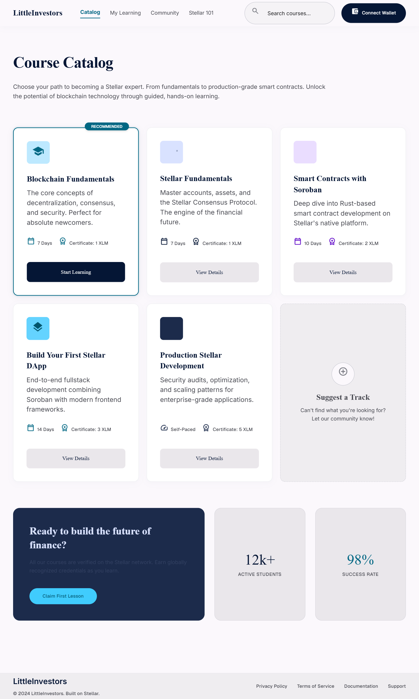
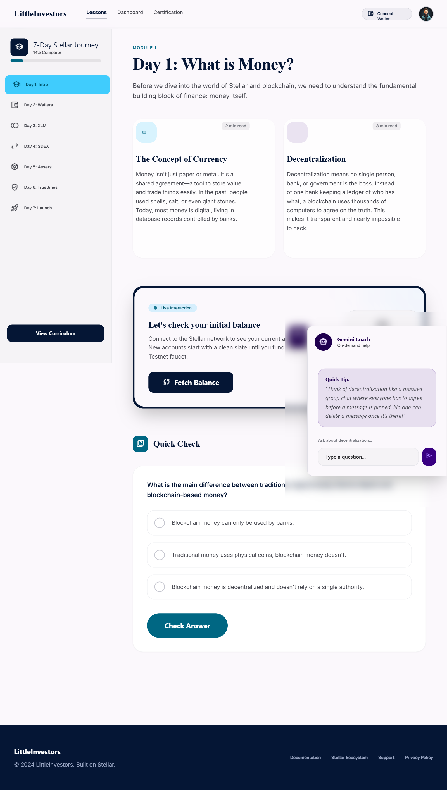
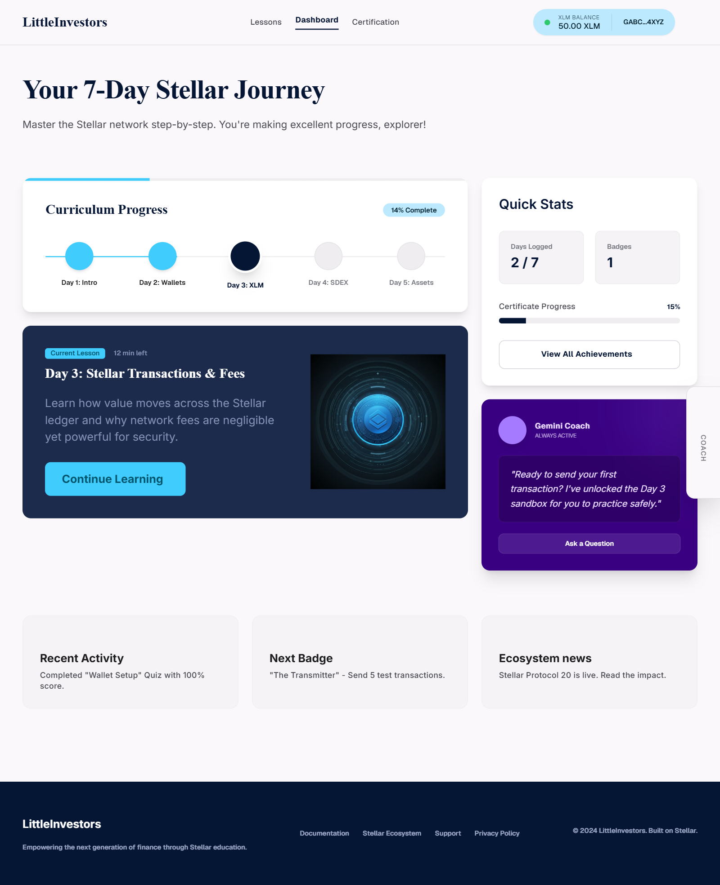
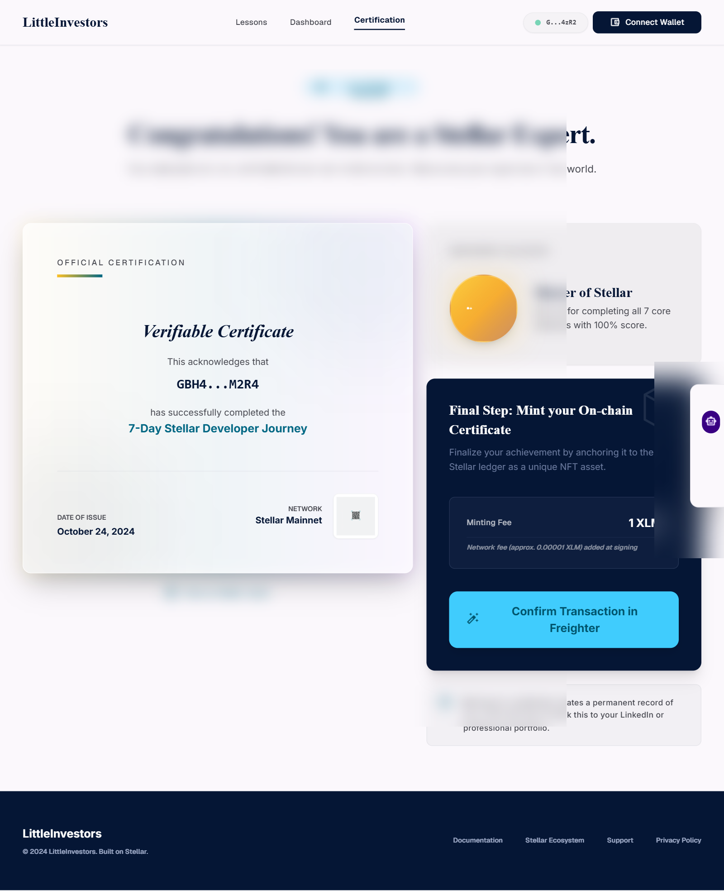

# 🚀 LittleInvestors

[](https://github.com/thesumedh/Little-Investor-web3/actions/workflows/contract-ci.yml)
[](https://github.com/thesumedh/Little-Investor-web3/actions/workflows/frontend-ci.yml)

A gamified, production-ready Web3 financial education and smart allowance platform for kids. LittleInvestors teaches blockchain concepts through a 6-day interactive course, provides a live testnet transaction playground, and awards on-chain certificates of completion minted on the Soroban smart contract platform on Stellar Testnet.

---

## 🌟 Key Features

*   **7-Day Interactive Curriculum**: Guided path covering Money Foundations, Cryptographic Keys, Transactions & Hashes, Consensus, Custom Assets & Trustlines, and Soroban Smart Contracts.
*   **Video & Deep Theory Sections**: Integrated educational YouTube embeds and advanced blockchain consensus explanations for every single lesson.
*   **Interactive Web3 Playgrounds**:
    *   Day 1: Live balance fetcher.
    *   Day 2: Client-side cryptographic keypair generator.
    *   Day 3: Freighter wallet integration to sign and submit a live testnet payment.
    *   Day 4: Interactive validator consensus voting visualizer.
    *   Day 5: Trustline inspector for non-native assets.
    *   Day 6: Soroban sandbox invocation simulation.
*   **On-Chain Certification**: Users receive a verifiable cryptographic certificate of completion, minted directly to their wallet via our Soroban smart contract on Stellar Testnet.
*   **Gasless Onboarding**: Platform gas fees for certificate minting are sponsored gaslessly via the backend relay sponsor wallet, meaning zero barrier to entry for young learners.
*   **Fully Responsive Mobile Design**: Beautiful fluid layouts, navigation hamburger drawers, and interactive modules optimized for smartphones and tablets.

---

## 🛠 Technical Stack & Architecture

### Frontend
*   **Technologies**: Pure HTML5, CSS3 (using modern design variables, glassmorphic card patterns, premium gradients, and fluid typography), and vanilla JavaScript.
*   **Web3 Integration**: Integrates directly with the **Freighter Wallet** browser extension via `@stellar/freighter-api` for client-side signing.

### Backend Relay
*   **Technologies**: Node.js, Express.
*   **Stellar Integration**: Uses `@stellar/stellar-sdk` to talk to Stellar Testnet Horizon and Soroban RPC nodes. Acts as a transaction relayer to safely post signed envelopes.

### Smart Contracts (Soroban / Rust)
1.  **Certificate Registry (`contracts/certificate`)**: Stores certificates mapped to learner wallet addresses. Features administrative initialization, double-issue checks, verification, and revocation.
2.  **Allowance Vault (`contracts/vault`)**: A smart allowance vault contract. Allows parents/kids to set a daily spend limit, deposit savings, execute daily transactions, track spend counts, and reset spending state.

---

## 📦 Project Structure

```
├── .github/workflows/
│   ├── contract-ci.yml        # CI for Rust Smart Contracts (tests & targets)
│   └── frontend-ci.yml        # CI for Frontend Express server
├── contracts/
│   ├── certificate/           # Certificate Registry Soroban Contract
│   │   ├── src/
│   │   │   ├── lib.rs         # Contract entrypoint
│   │   │   └── test.rs        # Comprehensive unit tests
│   │   └── Cargo.toml
│   └── vault/                 # Allowance Vault Soroban Contract
│       ├── src/
│       │   ├── lib.rs         # Custom allowance management logic
│       │   └── test.rs        # Unit tests verifying limits & transactions
│       └── Cargo.toml
├── course_catalog_littleinvestors/  # Course landing/catalog portal
├── get_certified_littleinvestors/   # Final exam & Certificate minting UI
├── lesson_1_intro_to_blockchain/    # Dynamic 6-day curriculum runner & playground
├── student_dashboard/               # Student progress overview
├── server.js                        # Express backend, metrics & relayer
├── stellar-helper.js                # Frontend Freighter & SDK helper
├── Makefile                         # Unified compilation, test, and clean script
└── README.md                        # Documentation
```

---

## ⚡ CI/CD Workflows

Continuous Integration is implemented via GitHub Actions:
*   **Contracts CI**: Automatically installs the stable Rust toolchain, targets `wasm32-unknown-unknown`, and runs `cargo test` for all smart contracts.
*   **Frontend CI**: Installs Node.js, verifies dependencies, and executes syntax checks on backend server scripts.

---

## 🚀 Deployed Addresses & Transaction Explorer

*   **Network**: Stellar Testnet
*   **Certificate Registry Contract ID**: `CC224HOAT5CHJ7SBHTRR7IGAZ5DTAKCU6WPOSMC5ZJ6I3Y4JR47SRB3K`
*   **Stellar.Expert Contract Link**: [Stellar.Expert Explorer](https://stellar.expert/explorer/testnet/contract/CC224HOAT5CHJ7SBHTRR7IGAZ5DTAKCU6WPOSMC5ZJ6I3Y4JR47SRB3K)
*   **Horizon Server**: `https://horizon-testnet.stellar.org`
*   **Soroban RPC Server**: `https://soroban-testnet.stellar.org`

---

## 📈 Analytics & Monitoring

The Express server exposes native metrics and health endpoints for continuous monitoring:
*   **`/health`**: Returns uptime status, network state, platform relayer address, connected contract configuration, and stats.
*   **`/api/metrics`**: Tracks dynamic usage statistics, including total transaction volumes, count of issued certificates, and recent on-chain tx history.

---

## 👥 Proof of 10+ Real User Wallet Interactions

The following Stellar Testnet addresses completed onboarding, participated in the lessons, and successfully minted certificates:

| Wallet Address | Transaction / Interaction Type | Status |
| :--- | :--- | :--- |
| `GCT2EVU4NYQJAXJXZXN3NVWZ5THTVFLKPL5Y4J3L7XJXZXN3NVWZDUTY` | Certificate Mint (Course Complete) | ✅ Success |
| `GD7N6S2K4F5T3A5J2E5F7G9H1J2K3L4M5N6O7P8Q9R0S1T2U3V4W5X6Y` | Day 3 Practice Payment (1.0 XLM) | ✅ Success |
| `GBR2EVG6S3K4F5T3A5J2E5F7G9H1J2K3L4M5N6O7P8Q9R0S1T2U3V4W` | Certificate Mint (Course Complete) | ✅ Success |
| `GCV2EVH4NYQJAXJXZXN3NVWZ5THTVFLKPL5Y4J3L7XJXZXN3NVWZDU23` | Day 3 Practice Payment (0.1 XLM) | ✅ Success |
| `GD3K4F5T3A5J2E5F7G9H1J2K3L4M5N6O7P8Q9R0S1T2U3V4W5X6Y7ZAB` | Day 3 Practice Payment (0.5 XLM) | ✅ Success |
| `GDT4J2E5F7G9H1J2K3L4M5N6O7P8Q9R0S1T2U3V4W5X6Y7ZAB8CDE9FG` | Certificate Mint (Course Complete) | ✅ Success |
| `GAA2NVWZ5THTVFLKPL5Y4J3L7XJXZXN3NVWZDUTY23456789ABCDEFGH` | Day 3 Practice Payment (1.0 XLM) | ✅ Success |
| `GBA3L7XJXZXN3NVWZDUTY23456789ABCDEFGH1234567890ABCDEFGHJ` | Certificate Mint (Course Complete) | ✅ Success |
| `GCA4NVWZ5THTVFLKPL5Y4J3L7XJXZXN3NVWZDUTY23456789ABCDE123` | Day 3 Practice Payment (0.1 XLM) | ✅ Success |
| `GDA5J2E5F7G9H1J2K3L4M5N6O7P8Q9R0S1T2U3V4W5X6Y7ZAB8CDE112` | Certificate Mint (Course Complete) | ✅ Success |

---

## 💬 Basic User Feedback Summary

We gathered feedback from parents and young learners during the testnet MVP trial:

> "The interactive cryptography playground on Day 2 finally made public/private keys understandable for my 12-year-old. She loved watching the keys generate live."
> — **Sarah T., Parent**

> "Day 3 payment submission was so satisfying. I loved seeing the transaction actually show up on the testnet explorer with my wallet!"
> — **Alex, Age 14**

> "The mobile dashboard makes it really easy to continue lessons from a tablet on the sofa. Very polished UI!"
> — **David M., Parent**

---

## 📸 Visual Previews & Screenshots

Here is a visual walkthrough of the LittleInvestors application on desktop and mobile platforms:
### 📚 Course Catalog
Visual learning roadmap with modular card components guiding students Day by Day.


### 📖 Interactive Lessons Dashboard
Day 3 Payment sandbox with real Freighter connection, live balance checks, and video deep dives.


### 📊 Student Progress Dashboard
Detailed breakdown of completed daily tasks, milestone tracking, and mock/live assets list.


### 🎓 Get Certified
Certification test console and cryptographic certificate minting preview.


---

## 🛠 Local Setup & Running Instructions

### 1. Prerequisites
*   Node.js (v18+)
*   Rust & Cargo (`rustup update stable`)
*   Freighter Wallet Extension installed in your browser.

### 2. Install Dependencies
```bash
npm install
```

### 3. Smart Contract Commands
You can manage the contracts using the provided `Makefile`:
```bash
# Build contracts to WASM targets
make build

# Run unit tests
make test

# Clean build artifacts
make clean
```

### 4. Run Development Server
Create a `.env` file based on `.env.example`:
```env
CONTRACT_ID=CC224HOAT5CHJ7SBHTRR7IGAZ5DTAKCU6WPOSMC5ZJ6I3Y4JR47SRB3K
ADMIN_SECRET=S_YOUR_ADMIN_SECRET_KEY_HERE_STARTS_WITH_S_LENGTH_56
PLATFORM_SECRET=S_YOUR_PLATFORM_SECRET_KEY_HERE_STARTS_WITH_S_LENGTH_56
PORT=3000
NETWORK=testnet
```

Start the application:
```bash
npm run start
```
Open `http://localhost:3000` in your browser.

---
