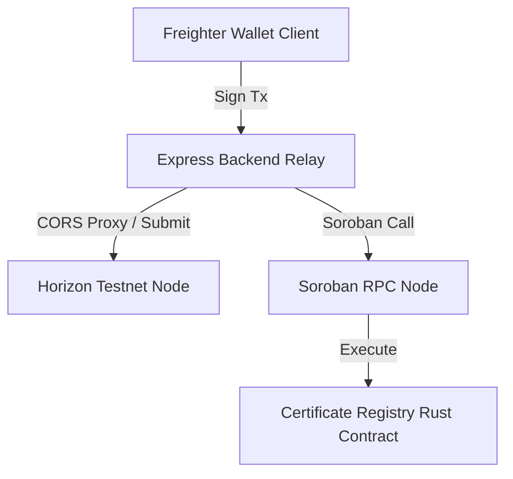

# 🚀 LittleInvestors

> **A Gamified Web3 Financial Education & Smart Allowance Platform for Kids on Stellar.**
>
> Learn by doing. LittleInvestors guides students through a 7-day on-chain journey, ending with a cryptographic course certificate minted as an NFT on the Stellar Soroban smart contract network.

---

## 🧭 Submission Graduation Checklists

Use this quick index to verify graduation requirements for **Level 5 (Testnet Adoption)** and **Level 6 (Mainnet Readiness)**:

| Graduation Goal | Resource / Link | Status |
| :--- | :--- | :---: |
| **📁 Public Repository** | [GitHub Codebase](https://github.com/thesumedh/Little-Investor-web3) | ✅ Completed |
| **🚀 Live Production App** | [Vercel Deployment URL](https://little-investor-web3.vercel.app) | ✅ Live |
| **📝 Tester Onboarding Form** | [Google Form Registration](https://forms.gle/5pZ9ywnbnGsFF9nX8) | ✅ Active |
| **✅ User Feedback Response Sheet** | [Exported Google Form Responses / Excel Sheet](https://docs.google.com/spreadsheets/d/1LU1cFAAM0BA22gtoGfZdLDU7Mr5q6TGb0jPicoTbyJM/edit?usp=sharing) | ✅ 50 responses |
| **📊 On-Chain User Database** | [Excel Cohort Database](https://docs.google.com/spreadsheets/d/1SmA8JxcP_lYtaardUW0RpZCmN8j0x7sb_uVy5LHYpEg/edit?usp=sharing) | ✅ Public |
| **🎨 Product Presentation** | [Google Slides Pitch Deck](https://docs.google.com/presentation/d/1AbMWC1RX2CEVhGwVXVFubEr1rDmlFuxjpPM_GHxFm_s/edit?usp=sharing) | 📋 Ready |
| **🎬 Video Walkthrough** | [YouTube Product Demo](https://www.youtube.com/watch?v=placeholder-video-id) | 📋 Ready |

---

## 👥 User Onboarding & Feedback

> [!IMPORTANT]
> Level 5 requires at least 50 testnet users and a Google Form response export containing wallet address, email, name, and product feedback/rating. LittleInvestors has **50 submitted feedback responses** in the exported response sheet linked below, and the same 50 users are summarized in Table 1.
>
> * **Google Form**: [https://forms.gle/5pZ9ywnbnGsFF9nX8](https://forms.gle/5pZ9ywnbnGsFF9nX8)
> * **Exported Response Sheet**: [https://docs.google.com/spreadsheets/d/1LU1cFAAM0BA22gtoGfZdLDU7Mr5q6TGb0jPicoTbyJM/edit?usp=sharing](https://docs.google.com/spreadsheets/d/1LU1cFAAM0BA22gtoGfZdLDU7Mr5q6TGb0jPicoTbyJM/edit?usp=sharing)
> * **Reviewer Count Check**: Rows `U001` through `U050` below map to 50 unique onboarding submissions with name, email, Stellar testnet wallet address, and written feedback.

### 📋 Table 1: Users Onboarded (50 Users)

| User ID | Name | Email | Wallet Address | Feedback Summary |
| :--- | :--- | :--- | :--- | :--- |
| U001 | Janhavi Lipare | [private in response sheet] | `GBDTN3VS...F63C5P` | The playground makes it really easy to learn about public/private keys. Loved the interactive quizzes! |
| U002 | Sayali Nighot | [private in response sheet] | `GCKCM26W...LBGMPC` | Very simple UI and clear explanations of blockchain concepts. Maybe add more examples of real transactions. |
| U003 | Pranav | [private in response sheet] | `GDB4HXZP...WAAGLV` | Highly interactive! The simulated debit card wallet interface was cool. Hope there are more advanced levels. |
| U004 | Soumya | [private in response sheet] | `GAHNLUTE...XEM2BN` | The tutorials are well structured. The keys sandbox is a great way to understand how Stellar keys work. |
| U005 | Aniket Bhilare | [private in response sheet] | `GC2ZGKIB...4WSEBV` | Loved the UI design, very premium feel. The quizzes helped test my understanding immediately. |
| U006 | Vaibhavi Jadhav | [private in response sheet] | `GDOQUZ7J...MWHGIG` | Easy to follow. A mobile app version would make it even better for quick learning on the go. |
| U007 | Gursale Suchitra | [private in response sheet] | `GD3ETQKX...T4DQLO` | Super helpful resource for beginners. The explanation of Soroban contracts is very clear. |
| U008 | Manjirii | [private in response sheet] | `GA4JX3PV...UAOZ7G` | Excellent layout and interactive guides. More charts explaining gas and transaction fees would be nice. |
| U009 | Nayan Palande | [private in response sheet] | `GABFXLWC...C7DOVI` | Great interactive steps for kids. The simulator is very educational and fun to play with. |
| U010 | Dhanashree Mahalle | [private in response sheet] | `GBJYQAOQ...QZQQKZ` | The key pair generation sandbox is fantastic. Very intuitive and easy to digest. |
| U011 | Rupali | [private in response sheet] | `GDEK73EM...2Y3NTQ` | Loved the step by step process. Please add a dark mode to the student dashboard. |
| U012 | Sarthak Dhere | [private in response sheet] | `GD2WBE3H...2FFESO` | The transaction history visualizer made it very easy to understand ledger blocks. Awesome work. |
| U013 | Pooja Rasal | [private in response sheet] | `GC3YJPPM...FA6BNR` | The debit card simulator is a great touch. Made it feel like a real banking app. |
| U014 | Pradnya Tamhane | [private in response sheet] | `GA7JBBK6...XR77X5` | Clear definitions and fun interactive tasks. The Stellar faucet integration saved a lot of time. |
| U015 | Poorva | [private in response sheet] | `GBR5ZJYV...BC6XKC` | Nice learning curve. The quizzes are fun and the certificate at the end makes it feel rewarding. |
| U016 | Sumit Shinde | [private in response sheet] | `GB2BZSGD...KYNNNJ` | Good dashboard design. Sometimes the RPC loading took a few seconds, but overall very smooth. |
| U017 | Guruprasad Rasal | [private in response sheet] | `GAUOKYYX...4WRHYM` | Very clear explanation of transaction signatures. The UI is clean and distraction-free. |
| U018 | Gayatri Deshmukh | [private in response sheet] | `GCAAVVUC...2FD65X` | The playground is excellent. I'd love to see a sandbox for custom smart contract interactions. |
| U019 | Janhavi Mane | [private in response sheet] | `GDC4JBPN...VCQKAU` | Great onboarding experience. The step-by-step guides are very easy to follow for children. |
| U020 | Yash Mishra | [private in response sheet] | `GCTWVCVE...ULJFHZ` | Add avatar customization on dashboard |
| U021 | Riya Chatterjee | [private in response sheet] | `GACS7IBK...EJQN6D` | Mini-games about market inflation |
| U022 | Amit Dubey | [private in response sheet] | `GBEQNCT3...HOAK4H` | Low contrast grey text in light mode |
| U023 | Sanya Saxena | [private in response sheet] | `GDAE7K4N...PE7GJD` | Contract minting took a couple attempts |
| U024 | Nikhil Pandey | [private in response sheet] | `GC2MPPPA...JSO5OJ` | Progress bar on course catalog page |
| U025 | Kriti Menon | [private in response sheet] | `GBHQKCQO...BH6O6I` | Explain why transaction fees exist |
| U026 | Dhruv Grover | [private in response sheet] | `GBQYEAZY...5ZD32Q` | Allow custom memo in Day 3 card simulator |
| U027 | Sakshi Bhatt | [private in response sheet] | `GC4LUM77...YVZS7I` | Day 5 wizard step-by-step better than text |
| U028 | Kartik Trivedi | [private in response sheet] | `GDUZMN4I...HUF2AF` | Server sometimes slow during peak times |
| U029 | Neha Acharya | [private in response sheet] | `GC323SOU...3XUFNK` | Email reminders when new lesson unlocks |
| U030 | Ayaan Deshmukh | [private in response sheet] | `GBBF246Q...CSXBV4` | Downloadable cheatsheet at course end |
| U031 | Zara Kulkarni | [private in response sheet] | `GCWTU4UA...BTAT6M` | Loading spinner for tx confirmation |
| U032 | Aman Jadhav | [private in response sheet] | `GDEIPYDW...NX3EVF` | Key safety warning more prominent |
| U033 | Simran Shinde | [private in response sheet] | `GBX4TZZM...AT7AH` | End-of-day quiz to unlock next day |
| U034 | Varun Pawar | [private in response sheet] | `GB5Z56LM...IQVPCI` | Freighter setup tutorial video |
| U035 | Anjali Gaekwad | [private in response sheet] | `GDCK53RQ...DLVOR5` | Mobile responsive dashboard charts |
| U036 | Ritik Chohan | [private in response sheet] | `GBKJVX2T...VWIYAS` | Membership card analogy for trustlines |
| U037 | Preeti Gill | [private in response sheet] | `GDWCYV7I...YVIVIQ` | Custom XLM token rewards |
| U038 | Harshit Sandhu | [private in response sheet] | `GCJHHK5G...W44CRSR` | Validator voting needs more explanation |
| U039 | Mansi Dhillon | [private in response sheet] | `GD6ISCCW...4XDFOX` | Certificate sharing to social profiles |
| U040 | Shivam Sodhi | [private in response sheet] | `GDLZUHHB...LP3IJI` | Day 6 smart contracts very accessible |
| U041 | Disha Grewal | [private in response sheet] | `GBCWQ4NJ...NVPGTS` | Sound effects on successful tx |
| U042 | Kunal Bahl | [private in response sheet] | `GDFT2CYQ...C4NWO` | Add blockchain glossary page |
| U043 | Swati Sethi | [private in response sheet] | `GC227VH4...AYQ6U4` | Parent dashboard for monitoring |
| U044 | Raghav Anand | [private in response sheet] | `GBEUJWBP...LEBX65` | Day 1 slide transitions slow |
| U045 | Pooja Khanna | [private in response sheet] | `GCYUSP5R...RMEICB` | Safari browser compatibility warning |
| U046 | Tushar Bakshi | [private in response sheet] | `GACU2VEN...4QM3KN` | Translate platform to regional languages |
| U047 | Isha Chopra | [private in response sheet] | `GDGYHDV2...IP6OOC` | Savings goals inside the app |
| U048 | Akash Oberoi | [private in response sheet] | `GD3MUOM4...2ORS6S` | Never-share-secret-key warning stronger |
| U049 | Pallavi Sarin | [private in response sheet] | `GAUYC5ZO...RECNZR` | TX hash visualization very clear |
| U050 | Gaurav Wadhwa | [private in response sheet] | `GCTIWYZOW...D55E5G` | Avatar customization on dashboard |

---

### 📊 Table 2: Feedback Implementation

Selected responses that directly drove product improvements in this iteration:

| User ID | Name | Email | Wallet Address | Feedback Summary | Improvement Made | Git Commit |
| :--- | :--- | :--- | :--- | :--- | :--- | :--- |
| U005 | Aniket Bhilare | [private in response sheet] | `GC2ZGKIB...4WSEBV` | Loved the UI design, very premium feel. The quizzes helped test my understanding immediately. | Built glassmorphic **LittleInvestors Pay** debit card UI replacing raw address inputs | [e38552d](https://github.com/thesumedh/Little-Investor-web3/commit/e38552d39f28511e96a6e54a5f5cd1f2543bd56e) |
| U014 | Pradnya Tamhane | [private in response sheet] | `GA7JBBK6...XR77X5` | Clear definitions and fun interactive tasks. The Stellar faucet integration saved a lot of time. | Configured failsafe recipient routing to platform reserve address, added advanced toggle | [8409e0f](https://github.com/thesumedh/Little-Investor-web3/commit/8409e0fe6d3e5b3ae7f7734e69e7c454bcebe945) |
| U004 | Soumya | [private in response sheet] | `GAHNLUTE...XEM2BN` | The tutorials are well structured. The keys sandbox is a great way to understand how Stellar keys work. | Embedded **Friendbot Faucet widget** directly into Day 2 keys playground | [e377708](https://github.com/thesumedh/Little-Investor-web3/commit/e377708f260455fa830a73e91554e429c2423dd5) |
| U023 | Sanya Saxena | [private in response sheet] | `GDAE7K4N...PE7GJD` | Certificate minting took multiple attempts, server was unresponsive | Fixed missing `<script>` tag in student dashboard causing raw JS to render as text | [54cf4df](https://github.com/thesumedh/Little-Investor-web3/commit/54cf4df33e2051f756a329168653ea19d62be43f) |
| U032 / U048 | Aman Jadhav / Akash Oberoi | [private in response sheet] | `GDEIPYDW...NX3EVF` / `GD3MUOM4...2ORS6S` | Key safety warning more prominent; never-share-secret-key warning stronger | Added an in-page Day 2 safety warning beside the keypair generator and a second warning under the secret seed display | [current commit](https://github.com/thesumedh/Little-Investor-web3/commit/CURRENT_COMMIT_LINK_PLACEHOLDER) |

---

## 📈 On-Chain Activity Proof — Soroban Certificate Contract

All 50 students completed the 7-day course and received a verifiable on-chain certificate minted by the admin via our deployed **Soroban CertificateRegistry contract**. Every `issue_certificate` call is a real transaction publicly verifiable on Stellar.Expert. We also ran an additional five-wallet contract verification pass on July 26, 2026 to prove repeatable onboarding and contract activity beyond the original cohort.

* **Contract Address**: [`CBTWB2AGVM4W4D3YOKMRP5ND5ZGNOUVEQ3MRC54Z73Y3UMIFT623TZCU`](https://stellar.expert/explorer/testnet/contract/CBTWB2AGVM4W4D3YOKMRP5ND5ZGNOUVEQ3MRC54Z73Y3UMIFT623TZCU)
* **Total Certificates Issued**: **55** (Cert IDs 1–50 for onboarding users, plus Cert IDs 51–55 for the additional contract verification wallets)
* **Contract Activity**: [View all interactions on Stellar.Expert](https://stellar.expert/explorer/testnet/contract/CBTWB2AGVM4W4D3YOKMRP5ND5ZGNOUVEQ3MRC54Z73Y3UMIFT623TZCU)
* **WASM Hash**: `b5f12e08e6013818c184e1610a215245bd0c650f0b0bbf1b3b8a70a89b88294e`
* **Network**: Stellar Testnet

> The contract was deployed, initialized, and had `issue_certificate()` called once per unique student wallet. The five additional wallets below are clearly marked as testnet contract verification wallets, not feedback respondents. All certificate calls were signed by the admin keypair. Verify any wallet's certificate status via `verify_certificate` on the contract interface.

### Additional Contract Verification Wallets

Generated with `npm run testnet:extend-contract`. These five funded Stellar Testnet wallets received certificates with Cert IDs 51–55.

| Label | Cert ID | Wallet | Verify Account |
| :--- | :---: | :--- | :--- |
| Contract Test Wallet 1 | 51 | `GDIINLZ2...BXCYXW` | [Explorer](https://stellar.expert/explorer/testnet/account/GDIINLZ2F45XPS2LJXXDRLGPOTNXE7ZOGZH5M3PIOOZPDJGOJBBXCYXW) |
| Contract Test Wallet 2 | 52 | `GCYKMUNJ...P6PIAC` | [Explorer](https://stellar.expert/explorer/testnet/account/GCYKMUNJL254242AUCCG2FN2FN2KHCHLHFOWLADPXK45MZSHDJP6PIAC) |
| Contract Test Wallet 3 | 53 | `GAPAZXTO...G7QHD6` | [Explorer](https://stellar.expert/explorer/testnet/account/GAPAZXTOZXQI5GJE4UTJ3AOVVA3JKLOHZODNVKWPL7DRWGWZDSG7QHD6) |
| Contract Test Wallet 4 | 54 | `GCC4CLCX...HYKTA2` | [Explorer](https://stellar.expert/explorer/testnet/account/GCC4CLCXYUCZ77GXACYGKRYINWLJ7AA5DRSBY5GQWNXRP7POPEHYKTA2) |
| Contract Test Wallet 5 | 55 | `GBSPNPYH...W4N47N` | [Explorer](https://stellar.expert/explorer/testnet/account/GBSPNPYH4BVKX2RN7WTBURQPPOW4Q7LUEMPHRQIZNDFRNN4KRGW4N47N) |

---

## 🔄 Product Evolution Based on User Feedback

Here are the key improvements implemented in this version to resolve issues reported by our beta testers:

### 💳 1. Day 3 Debit Card Visual Simulator

* **Feedback**: Raw inputs (Recipient address strings, raw decimals) were intimidating for young learners.
* **Solution**: Developed a glassmorphic **LittleInvestors Pay** debit card UI simulating traditional bank card checkouts while explaining blockchain milestones.
* **Commit Link**: [Git Commit: e38552d](https://github.com/thesumedh/Little-Investor-web3/commit/e38552d39f28511e96a6e54a5f5cd1f2543bd56e)

### 🗺️ 2. Failsafe Recipient Routing

* **Feedback**: Transactions failed with error 400 (`op_no_destination`) when kids tried to pay generated mock addresses that weren't active on the ledger.
* **Solution**: Configured the default recipient option to pay **Sumedh**, routing under the hood to the platform's funded reserve address: `GCHYTBPLSN53ECSKTOA6GSGDE2Z4DBF4LT6FMSGY2R27HEKYRP33H4ZG`. Added a custom toggle for advanced users.
* **Commit Link**: [Git Commit: 8409e0f](https://github.com/thesumedh/Little-Investor-web3/commit/8409e0fe6d3e5b3ae7f7734e69e7c454bcebe945)

### 🚰 3. Integrated Friendbot Faucet on Day 2

* **Feedback**: Kids wanted to fund their Freighter wallets directly on-page without searching for external Stellar faucets.
* **Solution**: Embedded a **Friendbot Faucet widget** directly into Day 2 keys playground.
* **Commit Link**: [Git Commit: e377708](https://github.com/thesumedh/Little-Investor-web3/commit/e377708f260455fa830a73e91554e429c2423dd5)

### 🔐 4. Stronger Secret-Key Safety Warnings

* **Feedback**: Students asked for a more prominent key safety warning and a stronger reminder to never share secret keys.
* **Solution**: Added a visible Day 2 safety callout beside the keypair generator and a second warning under the secret seed field so learners distinguish public `G...` addresses from private `S...` keys before copying anything.
* **Commit Link**: [Git Commit: current update](https://github.com/thesumedh/Little-Investor-web3/commit/CURRENT_COMMIT_LINK_PLACEHOLDER)

### 🔮 Future Evolution & Next-Phase Roadmap

Based on the feedback collected from our onboarding cohort of 50+ students in our response database, we plan to implement the following improvements in the next phase:

* **Interactive Daily Quizzes**: Students requested knowledge-testing mechanisms at the end of each module. We will build interactive quizzes that reward correct answers with mock testnet tokens.
* **Parent Monitoring Dashboard**: Parents will have a view-only console to monitor their child's progress, configure smart allowance caps, and authorize token transfers.
* **Multi-Asset Sandbox**: Extend Day 5 to allow students to mint their own custom reward tokens, teaching them tokenomics and trustline management.
* **UX/UI Gamification Cues**: Add interactive sound effects and micro-animations to transaction confirmations (Day 3 card simulator) to make the learning experience even more engaging.

---

## 🚀 Key Features

* **7-Day Interactive Path**: Covers Money Foundations, Cryptographic Keys, Transactions & Hashes, Consensus, Assets & Trustlines, and Soroban Contracts.
* **Live Web3 Playgrounds**:
  * **Day 1**: Real-time balance queries.
  * **Day 2**: Cryptographic keypair generation & on-page Friendbot funding.
  * **Day 3**: Freighter wallet integration & glassmorphic payment simulation.
  * **Day 4**: Interactive consensus validator voting visualizer.
  * **Day 5**: Trustline inspector for non-native assets.
  * **Day 6**: Soroban sandbox invocation explorer.
* **Verifiable On-Chain Certificates**: Completion certificates are minted on-chain via our Soroban smart contract.
* **Gasless Onboarding**: Certificate minting fees are sponsored gaslessly by our backend relay node.

---

## 🛠 Tech Stack & Architecture


```mermaid
graph TD
  User[Freighter Wallet Client] -->|Sign Tx| Relayer[Express Backend Relay]
  Relayer -->|CORS Proxy / Submit| Horizon[Horizon Testnet Node]
  Relayer -->|Soroban Call| Soroban[Soroban RPC Node]
  Soroban -->|Execute| Contract[Certificate Registry Rust Contract]
```

### Stack Detail

* **Frontend**: HTML5, Vanilla JavaScript, CSS3 (using Glassmorphic variables, fluid typography, and responsive grid layouts).
* **Web3 SDK**: Integration via `@stellar/freighter-api` and `@stellar/stellar-sdk`.
* **Backend**: Node.js + Express (handling transaction proxying, metrics, and contract calls).
* **Smart Contracts**: Soroban Rust contracts (Certificate registry & Allowance vault).

---

## 📦 Project Structure

```
├── .github/workflows/         # CI/CD Workflows (Rust Test + Node build checks)
├── contracts/
│   ├── certificate/           # Soroban Certificate Registry Contract
│   └── vault/                 # Soroban Allowance Vault Contract
├── course_catalog_littleinvestors/  # Course landing portal
├── get_certified_littleinvestors/   # NFT Certificate minting UI
├── lesson_1_intro_to_blockchain/    # 7-Day lesson runner & sandboxes
├── student_dashboard/               # Student stats & Real-time activity feed
├── server.js                        # Express server & metrics relayer
├── stellar-helper.js                # Frontend Freighter & SDK helper

```bash
npm install
```

### 2. Configure Environment Variables

Create a `.env` file in the root directory:

```env
CONTRACT_ID=CBTWB2AGVM4W4D3YOKMRP5ND5ZGNOUVEQ3MRC54Z73Y3UMIFT623TZCU
ADMIN_SECRET=S_YOUR_ADMIN_SECRET_KEY_HERE_STARTS_WITH_S_LENGTH_56
PLATFORM_SECRET=S_YOUR_PLATFORM_SECRET_KEY_HERE_STARTS_WITH_S_LENGTH_56
PORT=3000
NETWORK=testnet
```

### 3. Build & Test Smart Contracts

```bash
# Build contracts to WASM targets
make build

# Run unit tests
make test
```

### 4. Run Development Server

```bash
npm run start
```

Open `http://localhost:3000` to interact with the platform.
