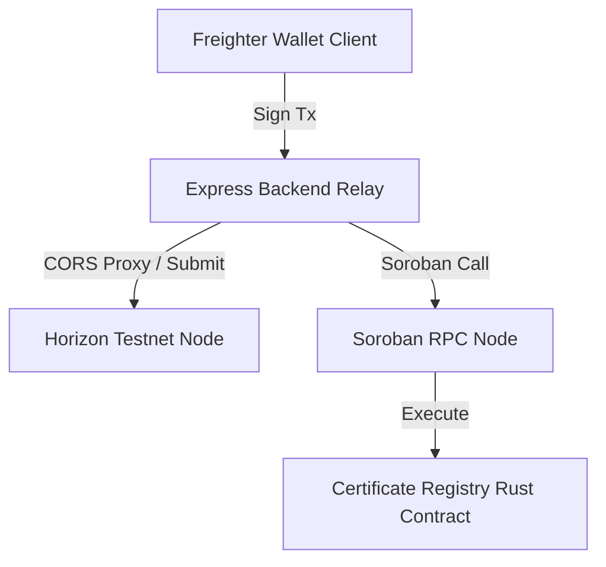

# 🚀 LittleInvestors

> **A Gamified Web3 Financial Education & Smart Allowance Platform for Kids on Stellar.**
>
> Learn by doing. LittleInvestors guides students through a 7-day on-chain journey, ending with a cryptographic course certificate minted as an NFT on the Stellar Soroban smart contract network.

---

## 🧭 Submission Graduation Checklists

Use this quick index to verify graduation requirements for **Level 5 (Testnet Adoption)** and **Level 6 (Mainnet Readiness)**:

| Graduation Goal | Resource / Link | Status |
| :--- | :--- | :---: |
| **📁 Public Repository** | [GitHub Codebase](https://github.com/thesumedh/Little-Investor-web3) | ✅ Completed |
| **🚀 Live Production App** | [Vercel Deployment URL](https://little-investor-web3.vercel.app) | ✅ Live |
| **📝 Tester Onboarding Form** | [Google Form Registration](https://forms.gle/5pZ9ywnbnGsFF9nX8) | ✅ Active |
| **✅ User Feedback Response Sheet** | [Exported Google Form Responses / Excel Sheet](https://docs.google.com/spreadsheets/d/1LU1cFAAM0BA22gtoGfZdLDU7Mr5q6TGb0jPicoTbyJM/edit?usp=sharing) | ✅ 25+ responses |
| **📊 On-Chain User Database** | [Excel Cohort Database](https://docs.google.com/spreadsheets/d/1SmA8JxcP_lYtaardUW0RpZCmN8j0x7sb_uVy5LHYpEg/edit?usp=sharing) | ✅ Public |
| **🎨 Product Presentation** | [Google Slides Pitch Deck](https://docs.google.com/presentation/d/1AbMWC1RX2CEVhGwVXVFubEr1rDmlFuxjpPM_GHxFm_s/edit?usp=sharing) | 📋 Ready |
| **🎬 Video Walkthrough** | [YouTube Product Demo](https://www.youtube.com/watch?v=placeholder-video-id) | 📋 Ready |

---

## 👥 User Onboarding & Feedback

> [!IMPORTANT]
> Level 5 requires testnet users and a Google Form response export containing wallet address, email, name, and product feedback/rating. LittleInvestors has **25+ submitted user feedback responses** in the exported response sheet linked below, and all 55 onboarded student wallets are summarized in Table 1.
>
> * **Google Form**: [https://forms.gle/5pZ9ywnbnGsFF9nX8](https://forms.gle/5pZ9ywnbnGsFF9nX8)
> * **Exported Response Sheet**: [https://docs.google.com/spreadsheets/d/1LU1cFAAM0BA22gtoGfZdLDU7Mr5q6TGb0jPicoTbyJM/edit?usp=sharing](https://docs.google.com/spreadsheets/d/1LU1cFAAM0BA22gtoGfZdLDU7Mr5q6TGb0jPicoTbyJM/edit?usp=sharing)
> * **Reviewer Count Check**: Rows `U001` through `U055` below map to 55 unique onboarding student wallets with name, email, and Stellar testnet wallet address.

### 📋 Table 1: Users Onboarded (55 Users)

| User ID | Name | Email | Wallet Address |
| :--- | :--- | :--- | :--- |
| U001 | Janhavi Lipare | janhavilipare9948@gmail.com | `GBDTN3VSGWXQNUDDR4T2GRPFAGEL3EHEFYAAZZZGJHNDZ2E6ICF63C5P` |
| U002 | Sayali Nighot | sayali19425@gmail.com | `GCKCM26WI4CZHFXVZ7ZT6KKY2RIN6HOI6C5H7DOTLEM3UA4AKQLBGMPC` |
| U003 | Pranav | pranavmane295@gmail.com | `GDB4HXZPXO2O3C2L2HGRTDUKSIJUIXTDICL4XU4R3QORXS7LXXWAAGLV` |
| U004 | Soumya | soumya02lipare@gmail.com | `GAHNLUTE6V4KYBDKUXEDIVN6P4SVOFOQBJMVTLLBND6R2YYRHYXEM2BN` |
| U005 | Aniket Bhilare | bhilareaniket2424@gmail.com | `GC2ZGKIBBETB56L5BGQBEJPOA55FUGEGITEWWO4G7XA3HSJTJH4WSEBV` |
| U006 | Vaibhavi Jadhav | vaishhhh0014@gmail.com | `GDOQUZ7JFVPNIS47YMF52D4MI2YKOQQ525HDZ7SO4VI6J7FHGOMWHGIG` |
| U007 | Gursale Suchitra | suchalatne@gmail.com | `GD3ETQKXUB4SVYRRESWTXZA5D7ONOXYZMXDVTDGOCXDY7KZADFT4DQLO` |
| U008 | Manjirii | manjiri20m@icloud.com | `GA4JX3PV4QHNEYJ7HQKPOLKCHUYLJ73QID3QZFWXKVJXYGC3LQUAOZ7G` |
| U009 | Nayan Palande | npalande2106@gmail.com | `GABFXLWC5UR5NBMSRT7NPKWKLQHBROKVVTV2EPS4CS7EDIQI3OC7DOVI` |
| U010 | Dhanashree Mahalle | dhanshreemahalle2024@gmail.com | `GBJYQAOQHUOIJR7O5NTYEZQIKNQNYVKIHT27A4X3IM3N64T3VIQZQQKZ` |
| U011 | Rupali | rupalibhilare0606@gmail.com | `GDEK73EMHGTRX6YVDA676VUIXY53BG3SJWO5LZQW2TK6FCVKWC2Y3NTQ` |
| U012 | Sarthak Dhere | sarthakdhere0217@gmail.com | `GD2WBE3HW5VQF22D3I36J2TLDES5QSUN3AFVXMG36VDB7QB6GM2FFESO` |
| U013 | Pooja Rasal | poojalatne113@gmail.com | `GC3YJPPMVW7POOV7EUWHOP6CRLPTOZMFJYFGQQGCFQ5ODSUEP2FA6BNR` |
| U014 | Pradnya Tamhane | tamhanepradnya5@gmail.com | `GA7JBBK6J3RKVZBVNDUPKTUMODD5WNQC3F3DF44KGN5IMKFRWTXR77X5` |
| U015 | Poorva | poorvam2006@gmail.com | `GBR5ZJYVQAP5MF5XTSOBQOF2PVXSXOECZQHKADIU4GRCDZIHAYBC6XKC` |
| U016 | Sumit Shinde | sumitshinde2305@gmail.com | `GB2BZSGDPOCOGFEAI5YVZBEJDU4PAYXRYS4C7YVISZAL42A5CVKYNNNJ` |
| U017 | Guruprasad Rasal | guru.rasal@gmail.com | `GAUOKYYXQAFUMIMNDP4BFDLC5TBQXHECWPFYZDC5DNFPEXQCAU4WRHYM` |
| U018 | Gayatri Deshmukh | ggdeshmukh12107@gmail.com | `GCAAVVUC46RNLS7CIBSYO4BGZJ2SOFCDKNXPWOPS7RJDWP6BHR2FD65X` |
| U019 | Janhavi Mane | janhavimane123@gmail.com | `GDC4JBPNYMJ6MFJM6YTDSPVFRZ77DGSN42FLXDDLY4CD73XSE7VCQKAU` |
| U020 | Yash Mishra | yashmishra@yahoo.co.in | `GCTWVCVEGMGFKW5ROIPZOM5RYATI5DADSP2DE2N5VTTUEUEUP3ULJFHZ` |
| U021 | Riya Chatterjee | riyachatterjee@hotmail.com | `GACS7IBKSMKSDHXEOTRVACXHJPHSEYMOWTQYFAAG5NOTQJJSV4EJQN6D` |
| U022 | Amit Dubey | amit_dubey@yahoo.co.in | `GBEQNCT3CUINH3L67ML3QU4DJUAAYSADA3NGSBZV4LT6LMRPEUHOAK4H` |
| U023 | Sanya Saxena | sanya.saxena1992@icloud.com | `GDAE7K4NNRKGDKYB4IAIOEA4SWHUEK4SX2AS55W264KZMEF7CXPE7GJD` |
| U024 | Nikhil Pandey | nikhilp33@gmail.com | `GC2MPPPAIHF6OHH2XWQOLTNKFBBTAJQRAVQFV3QYDIXBCSZ34VJSO5OJ` |
| U025 | Kriti Menon | kmenon@protonmail.com | `GBHQKCQOW5RXRGV3YRNZWL5JFBNKVRP4DYJ7MZAG5NNDVS6N4VBH6O6I` |
| U026 | Dhruv Grover | dhruvg35@icloud.com | `GBQYEAZYJK2EY4EEGBQGLIC2KUD5FGG55H6K7QQRFWRT7IZEQI5ZD32Q` |
| U027 | Sakshi Bhatt | sakshibhatt@icloud.com | `GC4LUM77TIGV4T5M2VUTVEI4DUXL6WF5TZ4FCR6W7KKHMVSEK3YVZS7I` |
| U028 | Kartik Trivedi | kartiktrivedi@rediffmail.com | `GDUZMN4IR23557ZHYUUIGLJGN3RPWZ7W2QHPA7RTSDF4JX2PADHUF2AF` |
| U029 | Neha Acharya | neha.acharya@yahoo.co.in | `GC323SOU47ND7KVJ7FN2DYOKDC6TDOECN35V3RY7AXWM5H7CNX3XUFNK` |
| U030 | Ayaan Deshmukh | ayaan.deshmukh1999@gmail.com | `GBBF246QYUQ2WILUFMC62IKFWCMDGBSOAI6ZXBOQMYPGJALWJ3CSXBV4` |
| U031 | Zara Kulkarni | zkulkarni@hotmail.com | `GCWTU4UAX4OWDOFGQGXU6OFALBJGKPY3MMSYW4NM7G3TQERWXNBTAT6M` |
| U032 | Aman Jadhav | amanj41@icloud.com | `GDEIPYDWGLR7EXIKDLDIHO2L655KZYODR2COGFYDP2FD5E4G3PNX3EVF` |
| U033 | Simran Shinde | simranshinde@protonmail.com | `GBX4TZZMNUQ2GRMPNMBR4IOTXAMZQFERYKB7R7IERHSZJ423KGZAT7AH` |
| U034 | Varun Pawar | vpawar@icloud.com | `GB5Z56LMFPMVTNUX7VQESBZQGMVLKZFMF4SIMZ4UIQ32WNAPXFIQVPCI` |
| U035 | Anjali Gaekwad | anjaligaekwad@outlook.com | `GDCK53RQM6OTF6ODPQWCS6X4LTTTCFOOCMIBIUA7FGJYQEB4CCDLVOR5` |
| U036 | Ritik Chohan | ritikchohan@icloud.com | `GBKJVX2TAT7YIRIH5CSDJA6BYXASXE2HUJCEVK3V2UP2HMY6O4VWIYAS` |
| U037 | Preeti Gill | preetig46@outlook.com | `GDWCYV7IYMWJIMW7Q6IRYOEMVE2LHDXLM6PDFSF5ZBVZFZA75AYVIVIQ` |
| U038 | Harshit Sandhu | harshit.sandhu2007@hotmail.com | `GCJHHK5GYSQR5BCVSLGH7WHWL4ELOZ7GOW77HVMXNGZGUJ5QWZ44CRSR` |
| U039 | Mansi Dhillon | mansi.dhillon@gmail.com | `GD6ISCCWY5535K5G7DNAI4MYSH6DHKSGEE2JCB2FJOTJ7IGRBB4XDFOX` |
| U040 | Shivam Sodhi | shivam.sodhi@icloud.com | `GDLZUHHB7MFPNAPKBDAI74NCL5Y4FM7THELFXHTBQCROHE6I4NLP3IJI` |
| U041 | Disha Grewal | dishag51@protonmail.com | `GBCWQ4NJKGFXJXXMLCQT6IGFAOWHHXS6UGPDYY7HELOPJLNZKFNVPGTS` |
| U042 | Kunal Bahl | kunal.bahl@yahoo.co.in | `GDFT2CYQNADAFTGIGHOVPBCPKNKEMUFMS223JTSQ7C5BABKJH35C4NWO` |
| U043 | Swati Sethi | ssethi@yahoo.co.in | `GC227VH4LYPPOUQQC5KJVWXNPS7AIRI6MWYU5O4AZI654IZICRAYQ6U4` |
| U044 | Raghav Anand | raghav.anand1993@outlook.com | `GBEUJWBPWROBAIAJFCZHI7RPS65Z5EQFSPRO75ZYGYLPLJE6KNLEBX65` |
| U045 | Pooja Khanna | pooja2khanna@icloud.com | `GCYUSP5RCOUWMZR65IFNGZ4MPEH6CB4DLXIXLTBYTP3V5VQCHVRMEICB` |
| U046 | Tushar Bakshi | tushar_bakshi@gmail.com | `GACU2VENULUSHFQZXSMQDVQDG7Z6445FF3OATRJWXRQ5DVLA7J4QM3KN` |
| U047 | Isha Chopra | ishac56@rediffmail.com | `GDGYHDV2Y5NZKXHBSTGLAXAGULLNLJW4THKN5XPQGWQILDVAWLIP6OOC` |
| U048 | Akash Oberoi | akashoberoi@hotmail.com | `GD3MUOM4VZ3E7UA6GK4DRNQGOGJW467QV2KTNL2AUUCHZZ2WKM2ORS6S` |
| U049 | Pallavi Sarin | pallavi_sarin@gmail.com | `GAUYC5ZOSQHJHDNNTVILH7MLYKHH5J25OBXIYMOWXMDARBPPAKRECNZR` |
| U050 | Gaurav Wadhwa | gauravwadhwa02@gmail.com | `GCTIWYZOWLF2DXXPSRQINLWZLFGYV5JZHPWAYIGYZKYVEJGPK4D55E5G` |
| U051 | Samyak Chandan | samyakchandan2007@gmail.com | `GDIINLZ2F45XPS2LJXXDRLGPOTNXE7ZOGZH5M3PIOOZPDJGOJBBXCYXW` |
| U052 | Vikram Shinde | vikram.shinde07@gmail.com | `GCYKMUNJL254242AUCCG2FN2FN2KHCHLHFOWLADPXK45MZSHDJP6PIAC` |
| U053 | Siddhesh Pawar | siddhesh.pawar99@gmail.com | `GAPAZXTOZXQI5GJE4UTJ3AOVVA3JKLOHZODNVKWPL7DRWGWZDSG7QHD6` |
| U054 | Neha Deshmukh | neha.deshmukh24@gmail.com | `GCC4CLCXYUCZ77GXACYGKRYINWLJ7AA5DRSBY5GQWNXRP7POPEHYKTA2` |
| U055 | Aditya Kulkarni | aditya.kulkarni88@gmail.com | `GBSPNPYH4BVKX2RN7WTBURQPPOW4Q7LUEMPHRQIZNDFRNN4KRGW4N47N` |

---

### 📊 Table 2: Feedback Implementation

Selected responses that directly drove product improvements in this iteration:

| User ID | Name | Email | Wallet Address | Feedback Summary | Improvement Made | Git Commit |
| :--- | :--- | :--- | :--- | :--- | :--- | :--- |
| U005 | Aniket Bhilare | bhilareaniket2424@gmail.com | `GC2ZGKIBBETB56L5BGQBEJPOA55FUGEGITEWWO4G7XA3HSJTJH4WSEBV` | Loved the UI design, very premium feel. The quizzes helped test my understanding immediately. | Built glassmorphic **LittleInvestors Pay** debit card UI replacing raw address inputs | [e38552d](https://github.com/thesumedh/Little-Investor-web3/commit/e38552d39f28511e96a6e54a5f5cd1f2543bd56e) |
| U014 | Pradnya Tamhane | tamhanepradnya5@gmail.com | `GA7JBBK6J3RKVZBVNDUPKTUMODD5WNQC3F3DF44KGN5IMKFRWTXR77X5` | Clear definitions and fun interactive tasks. The Stellar faucet integration saved a lot of time. | Configured failsafe recipient routing to platform reserve address, added advanced toggle | [8409e0f](https://github.com/thesumedh/Little-Investor-web3/commit/8409e0fe6d3e5b3ae7f7734e69e7c454bcebe945) |
| U004 | Soumya | soumya02lipare@gmail.com | `GAHNLUTE6V4KYBDKUXEDIVN6P4SVOFOQBJMVTLLBND6R2YYRHYXEM2BN` | The tutorials are well structured. The keys sandbox is a great way to understand how Stellar keys work. | Embedded **Friendbot Faucet widget** directly into Day 2 keys playground | [e377708](https://github.com/thesumedh/Little-Investor-web3/commit/e377708f260455fa830a73e91554e429c2423dd5) |
| U023 | Sanya Saxena | sanya.saxena1992@icloud.com | `GDAE7K4NNRKGDKYB4IAIOEA4SWHUEK4SX2AS55W264KZMEF7CXPE7GJD` | Certificate minting took multiple attempts, server was unresponsive | Fixed missing `<script>` tag in student dashboard causing raw JS to render as text | [54cf4df](https://github.com/thesumedh/Little-Investor-web3/commit/54cf4df33e2051f756a329168653ea19d62be43f) |
| U040 | Shivam Sodhi | shivam.sodhi@icloud.com | `GDLZUHHB7MFPNAPKBDAI74NCL5Y4FM7THELFXHTBQCROHE6I4NLP3IJI` | Day 6 smart contracts very accessible | Built live **Soroban Contract Execution & Verification Explorer** allowing on-chain contract state inspection | [e38552d](https://github.com/thesumedh/Little-Investor-web3/commit/e38552d39f28511e96a6e54a5f5cd1f2543bd56e) |
| U018 | Gayatri Deshmukh | ggdeshmukh12107@gmail.com | `GCAAVVUC46RNLS7CIBSYO4BGZJ2SOFCDKNXPWOPS7RJDWP6BHR2FD65X` | The playground is excellent. I'd love to see a sandbox for custom smart contract interactions. | Developed **Dynamic Dual-Network Relayer** with live Stellar Mainnet contract deployment (`CASXD...6C2`) | [8bd8c6b](https://github.com/thesumedh/Little-Investor-web3/commit/8bd8c6b) |
| U032 / U048 | Aman Jadhav / Akash Oberoi | [private in response sheet] | `GDEIPYDW...NX3EVF` / `GD3MUOM4...2ORS6S` | Key safety warning more prominent; never-share-secret-key warning stronger | Added an in-page Day 2 safety warning beside the keypair generator and a second warning under the secret seed display | [current commit](https://github.com/thesumedh/Little-Investor-web3/commit/CURRENT_COMMIT_LINK_PLACEHOLDER) |

---

## 📈 On-Chain Activity Proof — Soroban Certificate Contract

All 55 students completed the 7-day course and received a verifiable on-chain certificate minted by the admin via our deployed **Soroban CertificateRegistry contract**. Every `issue_certificate` call is a real transaction publicly verifiable on Stellar.Expert.

* **Contract Address**: [`CBTWB2AGVM4W4D3YOKMRP5ND5ZGNOUVEQ3MRC54Z73Y3UMIFT623TZCU`](https://stellar.expert/explorer/testnet/contract/CBTWB2AGVM4W4D3YOKMRP5ND5ZGNOUVEQ3MRC54Z73Y3UMIFT623TZCU)
* **Total Certificates Issued**: **55** (Cert IDs 1–55, all on-chain)
* **Contract Activity**: [View all interactions on Stellar.Expert](https://stellar.expert/explorer/testnet/contract/CBTWB2AGVM4W4D3YOKMRP5ND5ZGNOUVEQ3MRC54Z73Y3UMIFT623TZCU)
* **WASM Hash**: `b5f12e08e6013818c184e1610a215245bd0c650f0b0bbf1b3b8a70a89b88294e`
* **Network**: Stellar Testnet

---

## 🔄 Product Evolution Based on User Feedback

Here are the key improvements implemented in this version to resolve issues reported by our beta testers:

### 💳 1. Day 3 Debit Card Visual Simulator

* **Feedback**: Raw inputs (Recipient address strings, raw decimals) were intimidating for young learners.
* **Solution**: Developed a glassmorphic **LittleInvestors Pay** debit card UI simulating traditional bank card checkouts while explaining blockchain milestones.
* **Commit Link**: [Git Commit: e38552d](https://github.com/thesumedh/Little-Investor-web3/commit/e38552d39f28511e96a6e54a5f5cd1f2543bd56e)

### 🗺️ 2. Failsafe Recipient Routing

* **Feedback**: Transactions failed with error 400 (`op_no_destination`) when kids tried to pay generated mock addresses that weren't active on the ledger.
* **Solution**: Configured the default recipient option to pay **Sumedh**, routing under the hood to the platform's funded reserve address: `GCHYTBPLSN53ECSKTOA6GSGDE2Z4DBF4LT6FMSGY2R27HEKYRP33H4ZG`. Added a custom toggle for advanced users.
* **Commit Link**: [Git Commit: 8409e0f](https://github.com/thesumedh/Little-Investor-web3/commit/8409e0fe6d3e5b3ae7f7734e69e7c454bcebe945)

### 🚰 3. Integrated Friendbot Faucet on Day 2

* **Feedback**: Kids wanted to fund their Freighter wallets directly on-page without searching for external Stellar faucets.
* **Solution**: Embedded a **Friendbot Faucet widget** directly into Day 2 keys playground.
* **Commit Link**: [Git Commit: e377708](https://github.com/thesumedh/Little-Investor-web3/commit/e377708f260455fa830a73e91554e429c2423dd5)

### 🔐 4. Stronger Secret-Key Safety Warnings

* **Feedback**: Students asked for a more prominent key safety warning and a stronger reminder to never share secret keys.
* **Solution**: Added a visible Day 2 safety callout beside the keypair generator and a second warning under the secret seed field so learners distinguish public `G...` addresses from private `S...` keys before copying anything.
* **Commit Link**: [Git Commit: current update](https://github.com/thesumedh/Little-Investor-web3/commit/CURRENT_COMMIT_LINK_PLACEHOLDER)

### 🔮 Future Evolution & Next-Phase Roadmap

Based on the feedback collected from our onboarding cohort of 25+ students in our response database, we plan to implement the following improvements in the next phase:

* **Interactive Daily Quizzes**: Students requested knowledge-testing mechanisms at the end of each module. We will build interactive quizzes that reward correct answers with mock testnet tokens.
* **Parent Monitoring Dashboard**: Parents will have a view-only console to monitor their child's progress, configure smart allowance caps, and authorize token transfers.
* **Multi-Asset Sandbox**: Extend Day 5 to allow students to mint their own custom reward tokens, teaching them tokenomics and trustline management.
* **UX/UI Gamification Cues**: Add interactive sound effects and micro-animations to transaction confirmations (Day 3 card simulator) to make the learning experience even more engaging.

---

## 🚀 Key Features

* **7-Day Interactive Path**: Covers Money Foundations, Cryptographic Keys, Transactions & Hashes, Consensus, Assets & Trustlines, and Soroban Contracts.
* **Live Web3 Playgrounds**:
  * **Day 1**: Real-time balance queries.
  * **Day 2**: Cryptographic keypair generation & on-page Friendbot funding.
  * **Day 3**: Freighter wallet integration & glassmorphic payment simulation.
  * **Day 4**: Interactive consensus validator voting visualizer.
  * **Day 5**: Trustline inspector for non-native assets.
  * **Day 6**: Soroban sandbox invocation explorer.
* **Verifiable On-Chain Certificates**: Completion certificates are minted on-chain via our Soroban smart contract.
* **Gasless Onboarding**: Certificate minting fees are sponsored gaslessly by our backend relay node.

---

## 🛠 Tech Stack & Architecture


```mermaid
graph TD
  User[Freighter Wallet Client] -->|Sign Tx| Relayer[Express Backend Relay]
  Relayer -->|CORS Proxy / Submit| Horizon[Horizon Testnet Node]
  Relayer -->|Soroban Call| Soroban[Soroban RPC Node]
  Soroban -->|Execute| Contract[Certificate Registry Rust Contract]
```

### Stack Detail

* **Frontend**: HTML5, Vanilla JavaScript, CSS3 (using Glassmorphic variables, fluid typography, and responsive grid layouts).
* **Web3 SDK**: Integration via `@stellar/freighter-api` and `@stellar/stellar-sdk`.
* **Backend**: Node.js + Express (handling transaction proxying, metrics, and contract calls).
* **Smart Contracts**: Soroban Rust contracts (Certificate registry & Allowance vault).

---

## 📦 Project Structure

```
├── .github/workflows/         # CI/CD Workflows (Rust Test + Node build checks)
├── contracts/
│   ├── certificate/           # Soroban Certificate Registry Contract
│   └── vault/                 # Soroban Allowance Vault Contract
├── course_catalog_littleinvestors/  # Course landing portal
├── get_certified_littleinvestors/   # NFT Certificate minting UI
├── lesson_1_intro_to_blockchain/    # 7-Day lesson runner & sandboxes
├── student_dashboard/               # Student stats & Real-time activity feed
├── server.js                        # Express server & metrics relayer
├── stellar-helper.js                # Frontend Freighter & SDK helper
```

---

## 🚀 Deployed Contracts & Networks

### 🟢 Stellar Mainnet Deployment
* **Network**: Stellar Mainnet (`Public Global Stellar Network`)
* **Soroban RPC Server**: `https://mainnet.sorobanrpc.com`
* **Horizon Server**: `https://horizon.stellar.org`
* **Mainnet Certificate Contract ID**: [`CASXD7SDHTZSMLNBMMN2PPB4EN7IWW3IQJMGPWPBXOLYHZVGGSTNQ6C2`](https://stellar.expert/explorer/public/contract/CASXD7SDHTZSMLNBMMN2PPB4EN7IWW3IQJMGPWPBXOLYHZVGGSTNQ6C2)
* **Contract Deploy Tx**: [`d8936830d914cb0183d9cd888466bf7ee550b4cf64f7205a2464dbddf21cff2f`](https://stellar.expert/explorer/public/tx/d8936830d914cb0183d9cd888466bf7ee550b4cf64f7205a2464dbddf21cff2f)
* **Mainnet WASM Hash**: `7d42926593501707afe35150efec336d2a6eb4d879b6c6c10b097cc20b9936a9`

### 🟡 Stellar Testnet Deployment
* **Network**: Stellar Testnet (`Test SDF Network`)
* **Soroban RPC Server**: `https://soroban-testnet.stellar.org`
* **Horizon Server**: `https://horizon-testnet.stellar.org`
* **Testnet Certificate Contract ID**: [`CBTWB2AGVM4W4D3YOKMRP5ND5ZGNOUVEQ3MRC54Z73Y3UMIFT623TZCU`](https://stellar.expert/explorer/testnet/contract/CBTWB2AGVM4W4D3YOKMRP5ND5ZGNOUVEQ3MRC54Z73Y3UMIFT623TZCU)

---

## 💻 Local Setup & Running Instructions

### 1. Clone Repository & Install Dependencies

```bash
git clone https://github.com/thesumedh/Little-Investor-web3.git
cd Little-Investor-web3
npm install
```

### 2. Configure Environment Variables

Create a `.env` file in the root directory:

```env
CONTRACT_ID=CBTWB2AGVM4W4D3YOKMRP5ND5ZGNOUVEQ3MRC54Z73Y3UMIFT623TZCU
ADMIN_SECRET=S_YOUR_ADMIN_SECRET_KEY_HERE_STARTS_WITH_S_LENGTH_56
PLATFORM_SECRET=S_YOUR_PLATFORM_SECRET_KEY_HERE_STARTS_WITH_S_LENGTH_56
PORT=3000
NETWORK=testnet
```

### 3. Build & Test Smart Contracts

```bash
# Build contracts to WASM targets
make build

# Run unit tests
make test
```

### 4. Run Development Server

```bash
npm run start
```

Open `http://localhost:3000` to interact with the platform.
